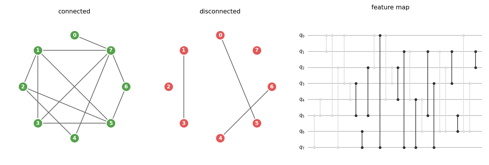
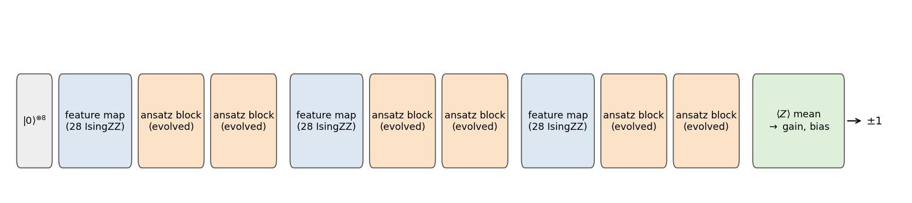
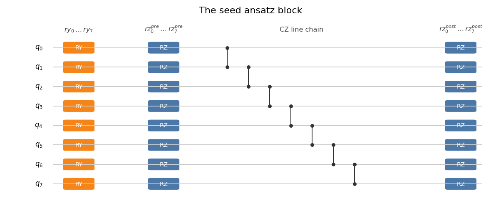
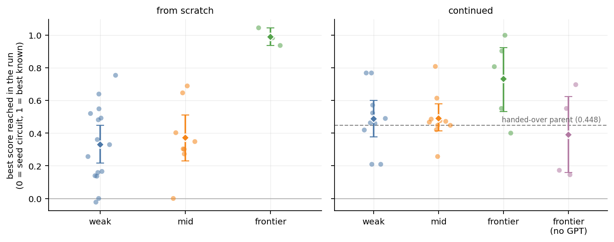
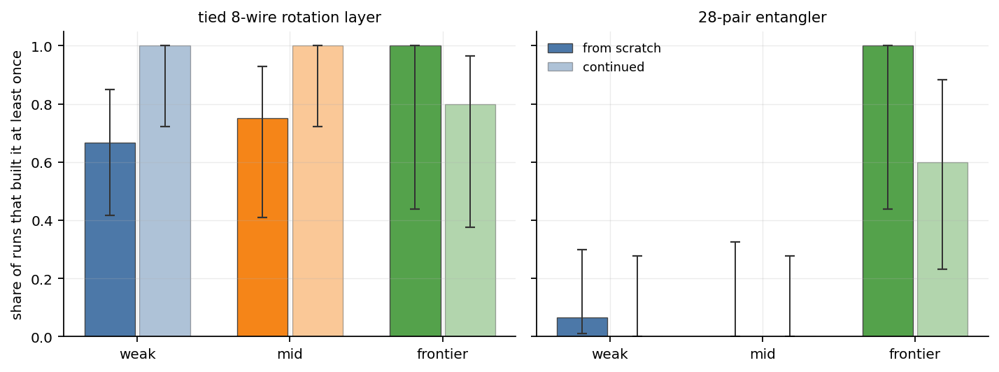
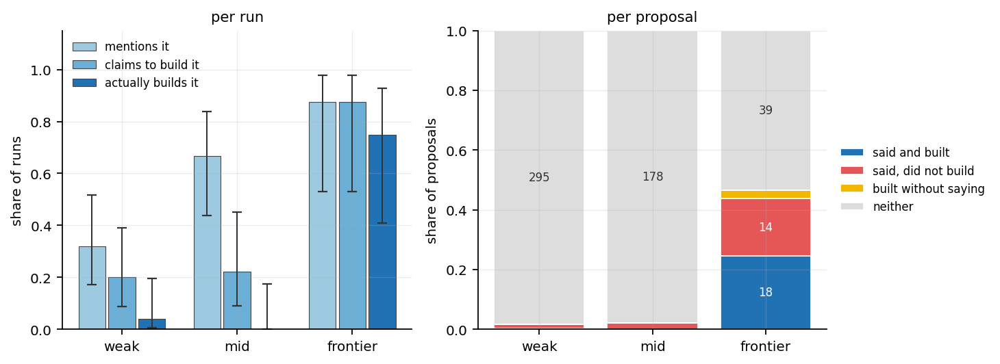
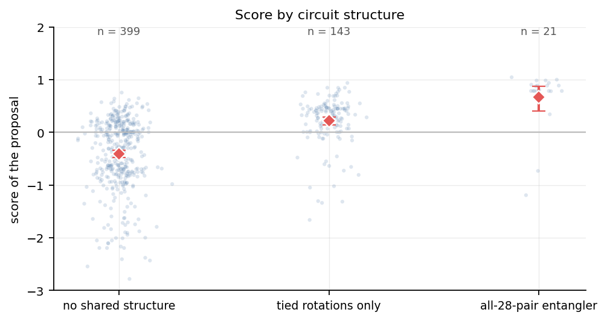
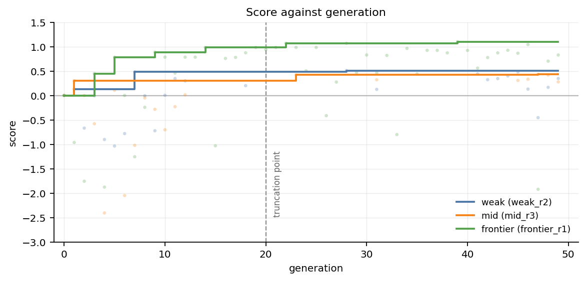
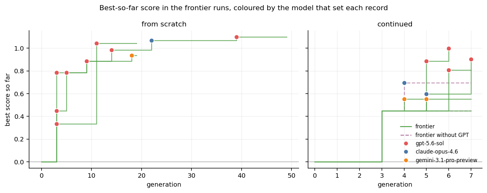
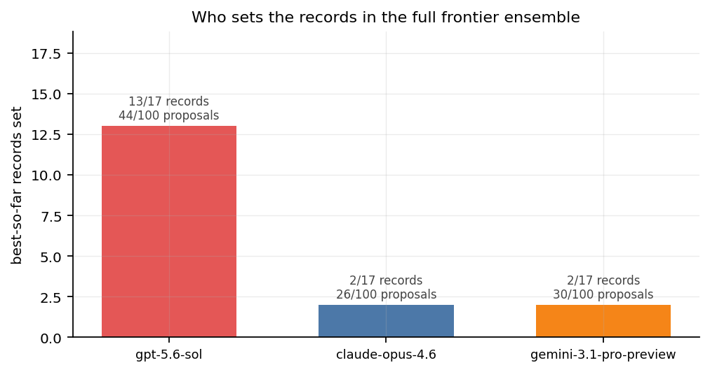

# Identifying Symmetries in Quantum Machine Learning with LLM-Guided Evolutionary Search

Cheng-You Ho, Aug 31, 2026

## Abstract

Quantum machine learning problems often exhibit symmetry that enables efficient ansatz designs. We investigate how LLMs with the ShinkaEvolve evolutionary search harness could identify symmetries when the key context of the problem is redacted. We ran three LLM ensembles across varying capabilities on an 8-qubit graph connectedness problem, which exhibits permutation invariant symmetry. We find that only the strongest ensemble is able to identify the correct symmetry. Starting the evolution with weaker ensembles after a few generations by the strongest ensemble did not enhance results significantly. Although stronger models describe the correct symmetry more often in the patch notes, they do not always build the correct ansatz more often. In addition, we realize that a strong model in an ensemble will be even more dominant in the evolutionary search by the design of ShinkaEvolve. 

## Introduction

Symmetry in quantum machine learning had been extensively studied. For instance, the tic-tac-toe problem is invariant under flips and $n\pi/2$ rotations ($n=1, 2, 3$) of the board. Thus, given the quantum mahcine learning problem of classifying the state of a tic-tac-toe board, the optimal solution should be the one that embeds the symmetry conditions in the design of the ansatz [1]. A direct follow-up of the work showed that although symmetry alone can inspire an ansatz, task-informed context is also necessary [2].

In nature, evolution happens through natural selection, where species which do not adapt to the environment well gradually fade out, while those which adapt well increases in number. Evolutionary Algorithms (EAs) find the optimal solution through a similar process [3]. EA is population-based: it first generates an initial population of solutions, and evaluates each of them with the fitness function. If any solution satisfy the goal, the algorithm is terminated. Else, solutions with lower fitness are removed. Those with higher fitness are mutated and crossed over to generate offspring solutions, which are passed through the fitness function again, and the cycle continues. ShinkaEvolve is an open source EA framework built upon LLMs [4]. It has improved parent sampling methods, rejection techniques, and LLM selection schemes compared to existing EAs. 

In this work, we investigate whether LLMs under the ShinkaEvolve harness are able to identify symmetries in a QML problem when faced with limited context about the problem itself. 

## Methodology

We define three model ensembles categorized by the capability of the LLMs included. Each ensemble contains three LLMs. Since a set of LLMs with more diverse training histories are more likely to explore the solution space, we chose different providers for each of the LLMs in each ensemble, in hope that when one model falls into a dead end, the other models could propose alternatives that drive the evolution forward. In addition to different models, each ensemble also uses different reasoning levels to further widen the gap between ensembles. The LLMs are hosted through the Openrouter API. The runs presented in this work cost roughly $80.

| ensemble | model | vendor | reasoning effort | input $/Mtok | output $/Mtok | mean cost per from-scratch run |
|---|---|---|---|---:|---:|---:|
| **weak** | `gpt-5.4-nano` | OpenAI | low | 0.20 | 1.25 | **$0.22** |
| | `gemini-3.1-flash-lite-preview` | Google | low | 0.25 | 1.50 | |
| | `qwen3-coder` | Qwen | none | 0.30 | 1.00 | |
| **mid** | `gpt-5.4-mini` | OpenAI | medium | 0.75 | 4.50 | **$1.00** |
| | `gemini-3-flash-preview` | Google | medium | 0.50 | 3.00 | |
| | `claude-haiku-4.5` | Anthropic | medium | 1.00 | 5.00 | |
| **frontier** | `gpt-5.6-sol` | OpenAI | xhigh | 5.00 | 30.00 | **$10.27** |
| | `claude-opus-4.6` | Anthropic | xhigh | 5.00 | 25.00 | |
| | `gemini-3.1-pro-preview` | Google | xhigh | 2.00 | 12.00 | |

In this work, we ask the model ensembles to optimize the ansatz for the following QML problem.
> Consider eight nodes in a graph, where each pair of nodes can either be disconnected or connected. You can travel from one node to the other if and only if they are connected. Given the connections between each of the 28 possible pairings of the eight nodes, are the eight nodes fully connected? I.e. is it possible to travel from any point to any other point?

This problem exhibits $S_8$ invariant symmetry since any relabling of the nodes do not change the answer.

The feature map is the first section of the QML circuit, where we encode whether each of the 28 pairs is connected or disconnected through quantum gates. *Each of the 28 possible pairings is assigned one qubit pair and one feature index. We apply $\mathrm{IsingZZ}_{\pi/2}$, a phase shift of $\pi/2$ along the Z axis to two qubits, if they are connected; if they are disconnected, no operation is performed. The figure below demonstrates which $\mathrm{IsingZZ}$ operations are applied when the graph is connected in a particular configuration. This way, we were able to encode the 28 features into 8 qubits.

A sequence of data re-uploading and ansatze repetitions follow the feature map. Before each ansatz block is applied $p = 2$ times, the feature map is applied once, and the pattern repeats $l=3$ times. This design enhances the original feature signals after the ansatz blocks. Owing to this repetition, if the ansatz block contains $m$ trainable parameters, the circuit as a whole will contain $6m$ trainable parameters. The re-uploading structure follows Pérez-Salinas et al. [5]. Finally, a readout layer collapses the quantum states into a single value. The mean of the expected Z value of each qubit is passed through a trainable linear function to generate the binary classification. If the 8-node graph is fully connected, the final output is $+1$, and $-1$ if the graph is not fully connected.

We use the Adam optimizer at learning rate 0.03, batch size 15, up to 1000 epochs with validation-loss early stopping of patience 75 and best-weight restore, on 450 training, 300 validation and 600 test records with balanced classes. We use MSE as the loss function. Circuits are simulated and trained in PennyLane [6].

The evolutionary search starts with the seed generation, whose circuit is a linear chain of CZ gates as well as RY and RZ gates.

At each generation, one model in the the ensemble proposes a design for the ansatz, which is repeated 6 times in the final QML circuit. The proposed circuit is in the format of a Python list where each entry is either:
1. Parameterized one-qubit gate: `{"gate": "RX"|"RY"|"RZ", "wire": w, "param": name}`
2. Parameterized two-qubit gate: `{"gate": "CNOT"|"CZ", "wires": [a, b]}`
3. Controlled rotation with no parameters: `{"gate": "CRX"|"CRY"|"CRZ", "wires": [a, b], "param": name}`

In addition, the model writes a patch note in natural language alongside the circuit. It contains the reasoning and justification of the newly proposed solution. We analyze the patch node to understand whether the model is aware of the symmetry in the problem.

After a circuit with the proposed ansatz is evaluated, the ensemble receives feedback in the form of a numerical score and metadata. The raw score is a weighted sum of six terms:

$$0.50\,a_{\text{val}} + 0.10\,a_{\text{train}} + 0.15\,s_{\text{gap}} + 0.15\,s_{\text{loss}} + 0.05\,s_{\text{params}} + 0.05\,s_{\text{conv}}$$

where $a$ are accuracies, $s_{\text{gap}}$ penalises the train-test accuracy gap, $s_{\text{loss}} = 1/(1 + \text{validation loss})$, $s_{\text{params}}$ rewards reaching a given accuracy with fewer parameters, and $s_{\text{conv}}$ rewards reaching 90% validation accuracy in fewer Adam steps. We apply a linear transformation to the raw score so that the seed circuit achieves a score of zero, while an $S_8$ invariant solution we found scores 1. We implemented this rescaling because we found the raw scores to cluster between 0.8 and 1.0 after a few test runs.

The ensemble sees the rescale score, the mean validation and test accuracy, the gap between training and testing accuracy, the MSE loss, parameter count, circuit depth and gate count. We intentionally removed context of the problem to reduce the likelihood that the models will simply recognize the symmetry from the problem description and generate the. Optimal solution immediately. By removing such descriptions, we incentivize the ensemble to test various solutions and identify the symmetry through trial and error. For instance, we hide the labelling rule, so that the models is unaware that fully connected circuits should be labelled $+1$ and $-1$ otherwise. As built-in in ShinkaEvolve, one of the models is chosen to generate the next generation by a UCB1 bandit over the ensemble.

In the ShinkaEvolve framework, three types of evolutionary nodes exist:

1. Diff, which makes a modification to the circuit of the parent node
2. Full, a full rewrite of the QML ansatz from scratch, and
3. Cross, a merge of two previous generations to form a new circuit.

These are sampled with probabilities 0.65, 0.25 and 0.10 respectively. By looking at which generations are in the context of a particular node in the evolutionary tree, we were able to make educated guesses about how breakthroughs were discovered.

We designed two types of runs. `from-scratch` runs start from the seed ansatz and end at 20 or 50 generations. The 20 generation runs are repeated several times aimed at testing reproducibility. `continued` runs start at generation 3 of a particular frontier-ensemble run at generation 3, right before the original run proposed the $S_8$ invariant circuit. The goal of these runs is to verify, given some head start, whether different ensembles are able to come up with the hidden symmetry.

We analyze the two aspects of each generation: circuit structure and patch notes. For the circle structure, we cut it into layers and identify symmetries in each. We define a layer as a maximal run of consecutive gate entries sharing one gate type and parameter key. For example, a block of eight RY gates all driven by `theta_star` is one layer, and a block of CZ gates is another. 

| label | definition | example | layers matched out of 3702 | circuits out of 563 | runs out of 55 |
|---|---|---|---:|---:|---:|
| `all-singular` | the layer's one-qubit gates cover all 8 wires, and every wire carries the same gate types | 8 RY gates, one per wire, each on its own angle | 1475 | 509 (90.4%) | 54 |
| `all-singular-tied` | `all-singular`, and all 8 gates are driven by a single shared parameter | 8 RY gates all reading `collective_ry` | 494 | 163 (29.0%) | 46 |
| `all-double` | the layer's two-qubit gates cover all 28 qubit pairs, and every pair carries the same gate types | 28 CZ gates, one on each pair of $K_8$ | 22 | 21 (3.7%) | 7 |
| `all-double-exact` | `all-double`, and invariant on its own: either one CZ per pair, or a controlled rotation with one shared angle applied in both directions on every pair | 28 CZ gates, each pair exactly once | 20 | 20 (3.6%) | 6 |
| `all-double-tied` | `all-double` driven by a single shared parameter | 56 CRZ gates on one angle, both directions on all 28 pairs | 1 | 1 (0.2%) | 1 |
| `linear-chain` | the two-qubit pairs are exactly $\{i, i{+}1\}$ for $i = 0 \dots 6$ | the seed's 7 CZ gates | 116 | 108 (19.2%) | 25 |
| `ring` | `linear-chain` plus the closing pair $\{7, 0\}$ | 8 CZ gates around the cycle | 141 | 132 (23.4%) | 30 |
| `mirror` | the layer is unchanged by the reflection $i \mapsto 7 - i$, and is not already `all-singular` or `all-double` | 4 CZ gates on $(0,1), (2,3), (4,5), (6,7)$ | 1081 | 520 (92.4%) | 54 |
| `cyclic` | the layer is unchanged by the rotation $i \mapsto i + 1 \bmod 8$, and is not a `ring` | 4 CZ gates on $(0,4), (1,5), (2,6), (3,7)$ | 180 | 165 (29.3%) | 47 |
| `none` | none of the above | 4 RY gates on wires 0-3 only | 1123 | 196 (34.8%) | 46 |

The definitions for these labels are not mutually exclusive. For example, an `all-singular` layer is automatically `mirror`. For the `all-double` layer, we acknowledge that the ordering of the 28 operations could affect the final quantum state. However, for simplicity of categorization, we neglect such novelty and accept any ordering of the 28 gates. As will be shown later, the definitions above lead to clear differences in scores; thus, the labels are able to separate programs which perform well from those that scores low. We analyze the patch notes independently to identify whether the models' reasoning involved symmetry. We design the following regex search to check this deterministically .

| flag | pattern (abbreviated) | notes matched out of 563 | runs out of 55 |
|---|---|---:|---:|
| `names_perm` | `permutation` \| `equivarian*` \| `invariant under (qubit\|wire\|vertex\|any\|every\|all)…` \| `relabel*` \| `interchange* of (qubits\|wires)` \| `S_?8` \| `vertex-(symmetr*\|permutation)` \| `(wire\|qubit\|index)-agnostic` | 26 (4.6%) | 11 |
| `all_pairs` | `all-to-all` \| `complete-(graph\|entangl*\|CZ\|network)` \| `K_?8` \| `all 28` \| `28 CZ` \| `28 (unordered) pairs` \| `every unordered pair` \| `fully-connected (graph\|entangl*\|topolog*)` \| `seven (disjoint) (perfect) matchings` \| `round-robin matchings` | 41 (7.3%) | 15 |
| `collective` | `collective*` \| `global (rotation\|mixer\|angle\|parameter\|RX\|RY\|RZ)` \| `(all\|every) 8 qubits shar*` \| `shar* across all 8 (qubits\|wires)` \| `(single\|one) shared (angle\|parameter) for all` \| `tied across all` \| `uniform (rotation\|angle\|parameter)` | 103 (18.3%) | 39 |
| `task_pairs` | `28 (binary) features` \| `(features\|dataset)…(qubit) pairs` \| `pairwise features` \| `all-pairs (feature\|encoding\|representation)` \| `IsingZZ…(all-to-all\|complete\|every pair)` \| `FEATURE_PAIRS` | 37 (6.6%) | 21 |
| `partial_sym` | `mirror*` \| `parity` \| `even-odd` \| `reflect*` \| `pair-(tied\|shared\|symmetr*)` \| `quadrant` \| `bipartite` \| `mod-3` \| `cyclic` \| `translation* (symmetr*\|invarian*)` | 152 (27.0%) | 46 |
| `breaks_sym` | `break* … symmetr*` \| `break* the (full) permutation` \| `symmetry-breaking` \| `relax* the (strict\|full) symmetr*` \| `(too\|overly) (restrictive\|symmetric)` \| `de-symmetri*` | 20 (3.6%) | 16 |
| `none` | no pattern above fires | 301 (53.5%) | 39 |

## Results

The table below shows the results of the ensembles under each setting.

| setting | ensemble | runs | own proposals | mean best score (95% CI) | runs building a tied 8-wire rotation layer | runs building the 28-pair entangler | proposals with the 28-pair entangler |
|---|---|---:|---:|---:|---:|---:|---:|
| from scratch | weak | 15 | 260 | 0.331 ± 0.116 | 10/15 | 1/15 | 1/260 |
| from scratch | mid | 8 | 142 | 0.370 ± 0.140 | 6/8 | 0/8 | 0/142 |
| from scratch | frontier | 3 | 58 | 0.988 ± 0.054 | 3/3 | 3/3 | 16/58 |
| continued | weak | 10 | 40 | 0.488 ± 0.111 | 10/10 | 0/10 | 0/40 |
| continued | mid | 10 | 40 | 0.490 ± 0.083 | 10/10 | 0/10 | 0/40 |
| continued | frontier | 5 | 15 | 0.732 ± 0.196 | 4/5 | 3/5 | 4/15 |
| continued | frontier without GPT | 4 | 8 | 0.391 ± 0.233 | 3/4 | 0/4 | 0/8 |

The graph below shows the best score per run. Apart from the frontier ensemble with all three models, all other configurations end up with similar scores. 

Almost all circuits are able to tie the 8 qubits together through a shared parameter. However, only the frontier models are able to identify the symmetry of the pairings and consistently perform the same operation on all 28 pairs.

| label | circuits | mean score (95% CI) |
|---|---:|---:|
| `all-double-tied` | 1 | +0.903 (n too small) |
| `all-double-exact` | 20 | +0.764 ± 0.157 |
| `all-double` | 21 | +0.671 ± 0.234 |
| `none` | 1 | +0.297 (n too small) |
| `all-singular-tied` | 163 | +0.286 ± 0.074 |
| `all-singular` | 509 | −0.239 ± 0.062 |
| `mirror` | 520 | −0.253 ± 0.058 |
| `linear-chain` | 108 | −0.306 ± 0.084 |
| `cyclic` | 165 | −0.309 ± 0.117 |
| `ring` | 132 | −0.563 ± 0.142 |

Next, we investigate the reasoning traces and the justifications of the ensembles in the patch notes. There is a funnel from mentioning the $S_8$ invariant symmetry in the patch note, claiming to having successfully built it, and actually building the symmetry in the circuit. The frontier models were the best at claiming to build whatever it mentions and also actually building what it claims to build, while the other ensembles is rarely consistant across these three metrics. Nevertheless, more capable models are better at identifying the symmetry in the patch note, although they are not necessarily able to build it correctly in the circuit.

By plotting the score of each circuit that satisfies some circuit structure, we see that entangling all 28 pairs gives the highest score while tying single-qubit rotations only give a slightly higher score than the seed. Therefore, it is always beneficial to include some sort of symmetry for this particular problem, but identifying the symmetry in the pairing is key to achieving a high score.

In the table below, we analyze some properties of the proposed solutions and calculate how often each ensemble satisfy each of them. Patterns involving the patch notes are more likely to follow the order of model capability. For instance, frontier models are better at noticing the feature map is all-pairs, followed by the mid-tier ensemble, then the weak ensemble. Model capability is reflected mainly in the patch notes, while the generated ansatz circuit is noisy since weaker models may produce a symmetry by accident.

| property | weak | mid | frontier | pattern |
|---|---:|---:|---:|---|
| runs where some note mentions the all-pairs structure | 8/25 (32%) | 12/18 (67%) | 7/8 (88%) | strictly monotone, and the only one where weak and mid separate |
| notes mentioning the all-pairs structure | 3.0% | 9.3% | 50.7% | monotone |
| notes noticing the feature map is all-pairs | 1.7% | 7.7% | 20.5% | monotone |
| notes talking about collective rotations | 8.3% | 19.2% | 50.7% | monotone |
| notes using explicit permutation vocabulary | 0.3% | 0.5% | 30.1% | monotone, weak ≈ mid |
| notes claiming to build the structure | 1.7% | 2.2% | 43.8% | monotone, weak ≈ mid |
| proposals with a tied 8-wire rotation layer | 20.0% | 28.6% | 63.0% | monotone, weak ≈ mid |
| mean run-best score | 0.394 | 0.437 | 0.828 | monotone, weak ≈ mid |
| runs building the 28-pair entangler | 1/25 (4%) | 0/18 (0%) | 6/8 (75%) | not monotone: mid is lowest |
| proposals building the 28-pair entangler | 0.3% | 0.0% | 27.4% | not monotone: mid is lowest |
| mean pairs covered by the widest layer | 8.3 / 28 | 7.3 / 28 | 13.2 / 28 | not monotone: mid is lowest |
| mean proposal score | −0.235 | −0.257 | −0.013 | not monotone: mid is lowest |
| notes discussing a smaller symmetry (mirror, parity, quadrant) | 19.3% | 45.1% | 12.3% | not monotone: mid is highest |

A plot of the score versus generation of the 50th generation runs shows that although all ensembles continues improving past generation 20, the improvement is small compared to the gain from generation 0 through 20. Therefore, the repetitions which end the evolution at generation 20 does not remove key information.

Looking at which model proposed each solution that achieved the running maximum score, we discovered that, in the frontier run, `GPT-5.6 Sol` is responsible for the overwhelming majority of best so far discoveries. We believe that in the frontier ensemble, GPT is overwhelmingly strong. Because ShinkaEvolve samples models based on their past performance, GPT may be sampled more frequently after it has generated a few excellent solutions. This enhances its dominance in the evolutionary run since it is more powerful than the other models and has more opportunities to propose solutions. Therefore, an ensemble which consists of models with significantly different capabilities could be harmful.

Across the eight runs that use all three frontier models, `GPT-5.6 Sol` set 13 of the 17 best-so-far records while making 44 of the 100 proposals; `Claude Opus 4.6` and `Gemini 3.1 Pro` set 2 records each from 26 and 30 proposals. In the two continued runs without GPT that improved at all, the record was set once by Opus and once by Gemini, and neither reached the score of the runs containing GPT.

## Conclusion and Remarks

### Conclusion

We run a LLM guided evolutionary search on a quantum machine learning problem with an inherent $S_8$ invariant symmetry. Of the three ensembles categorized by model capabilities, only the frontier ensemble is able to consistently identify the symmetry and build an ansatz that safisfies it. Starting the evolution with a few generations produced by the frontier models, the weak and mid-tier ensembles were still unable to craft a circuit which satisfy the pairing symmetry.

Nevertheless, we found a monotone relationship when looking at the reasoning traces of the ensembles. LLMs were able to identify the symmetries but unable to implement them in the proposed ansatz. Our work demonstrates that while LLMs can be helpful tools in guiding evolutionary research, their solutions must be taken with caution.

### Remarks and Future Directions

The definitions for the patch note labels and the circuit labels are tailored to this specific QML problem and are designed manually through trial and error. Although this gives interpretable results, the methodology is not replicable nor easily transferrable to other QML problems. In addition, pattern matching for the structure of the quantum circuit is often insufficient in identifying layer symmetries when, for example, a single-qubit layer is embedded in the middle of an `all-double` layer. The method for identifying symmetries in the patch note descriptions as well as the circuit structure should be redesigned to be more reproducible and deterministic. Nevertheless, this report serves as an exploratory result into how LLMs may guide evolutionary search in problems that exhibit symmetry.

## References

1. Meyer, J. J. et al. *Exploiting Symmetry in Variational Quantum Machine Learning.* PRX Quantum 4, 010328, 2023. arXiv:2205.06217.
2. Baumann, M., Linnhoff-Popien, C. *Exploiting More Than Symmetry in Variational Quantum Machine Learning.* arXiv:2606.20316, 2026.
3. Eiben, A. E., Smith, J. E. *Introduction to Evolutionary Computing.* 2nd edition, Springer, 2015.
4. Lange, R. T. et al. *ShinkaEvolve: Towards Open-Ended and Sample-Efficient Program Evolution.* arXiv:2509.19349, 2025.
5. Pérez-Salinas, A., Cervera-Lierta, A., Gil-Fuster, E., Latorre, J. I. *Data re-uploading for a universal quantum classifier.* Quantum 4, 226, 2020.
6. Bergholm, V. et al. *PennyLane: Automatic differentiation of hybrid quantum-classical computations.* arXiv:1811.04968.
