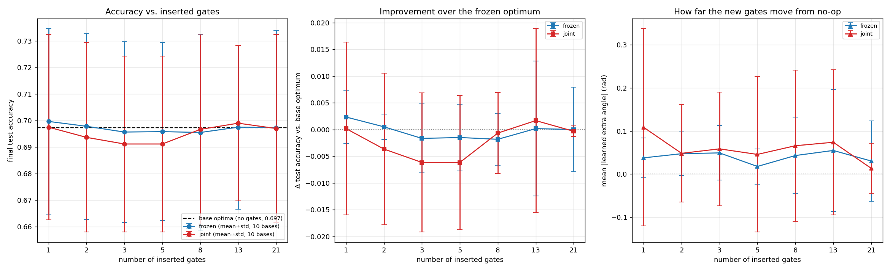

# Frozen-Original Gate-Insertion Report — cemoid L=3, P=2

**Question:** Take a cemoid (L=3, P=2) classifier **trained to convergence** — an
*optimal solution*. **Freeze** its 54 rotation angles. Now insert extra rotation
gates (initialised to a perfect no-op) and train **only the new gates' angles**,
leaving every original angle fixed. Can the added gates improve the model, and how
far do their angles move from zero?

This sharpens the earlier gate-insertion test (`gate_insertion_report.md`). That
test *jointly* optimised the original 54 angles together with the inserted gates,
so the originals could co-adapt — which made it impossible to separate "the added
gate helped" from "the whole circuit re-optimised." By **freezing the optimum** we
isolate the marginal value of the inserted gates alone.

**Headline result.** Freezing a converged optimum and training added gates yields
**no accuracy improvement at any gate count** (frozen Δ test accuracy = −0.0003 ±
0.0073 across all 70 runs, i.e. statistically zero), and the new gates **barely
leave their no-op start** (median learned |θ| = **0.000 rad**; mean 0.039; only
12% of inserted gates exceed 0.1 rad). The frozen-optimality hypothesis is
**supported**: the converged L=3, P=2 solution is a *constrained optimum* — no
single added gate, with originals fixed, can improve it. This **overturns the
earlier test's "degenerate-attractor" reading**: that 0.09–0.35 rad drift was an
artifact of jointly optimising extras alongside *random-initialised, under-trained*
originals, not a property of the optimum. The residual drift that does occur is
**accuracy-neutral** (flat directions), not unexploited capacity.

---

## 1. Motivation & hypothesis

A converged solution lives in the 54-dimensional cemoid parameter space. Inserting
a new rotation gate adds a *new* axis the original optimisation never saw. At a
genuinely "complete" optimum, opening that one extra direction — **with the
originals held fixed** — should buy nothing: the new angle should sit at ≈ 0 (its
no-op start) and accuracy should not change.

> **Frozen-optimality hypothesis.** With the 54 original angles fixed at their
> converged values, training an inserted gate from θ = 0 leaves θ ≈ 0 and leaves
> test accuracy unchanged. Movement away from 0 (with an accuracy gain) means the
> frozen ansatz left unexploited capacity that the added gate captures *without*
> any help from the originals.

This differs from the old test's conclusion. The old (joint) test found that
inserted angles drift to 0.09–0.35 rad and read that as *landscape degeneracy*
(originals + extras jointly relax to a different, equally-good solution). The frozen
test asks the stricter, cleaner question: is the converged point a **constrained**
optimum along newly-added single-gate directions?

**Why the frozen test is well-posed.** Because each inserted gate starts at θ = 0,
the augmented circuit at initialisation reproduces the base optimum *exactly*
(same validation loss, same accuracy). Combined with restore-best-weights on
validation loss, the frozen condition can therefore **never do worse** than the
base optimum — its validation loss can only stay equal or improve. So any reported
Δaccuracy is a clean measure of constrained improvement, not initialisation noise.

---

## 2. Methodology

### 2.1 Data source

Generated programmatically from the rules of tic-tac-toe (`initial_program.py`):

- `enumerate_valid_boards()` depth-first expands all legal play sequences (cross
  first), stopping at a win or full board → **5,478 unique legal boards**.
- 3 classes via `board_label()`: `cross` (626) / `circle` (316) / `draw` (4,536).
- Encoding: length-9 vector, +1/−1/0 per cell; value *i* → qubit *i* via RX scaled
  by `FEATURE_SCALE = 2π/3`. Labels are ±1 one-hot triples.

### 2.2 Splits

`build_data_splits(seed=2027)` — class-balanced, `default_rng(2027)`:

| Split | Size | Per class | Purpose |
|---|---:|---:|---|
| Train | 450 | 150 | gradient updates |
| Validation | 300 | 100 | early-stopping signal + model selection |
| Test | 600 | 200 | held-out reporting only |

Data seed fixed at 2027 throughout (same data for base training and insertion);
`circle` undersampling forces sampling with replacement to keep balanced sizes.

### 2.3 The three-step protocol

**Step 1 — obtain optimal solutions (base optima).** Train the base L=3, P=2 cemoid
(54 params, no extra gates) to convergence under validation-loss early stopping
(patience 75, min_delta 1e-4, max_epochs 1000, restore-best-weights; Adam lr 0.03,
30 steps/epoch, batch 15). Done for **10 independent initialisation seeds (0–9)**;
the 54 converged angles of each are saved (`base_optima/seed_NN.json`). These 10
serve as the fixed "optimal solutions."

**Step 2 — insert gates.** For each base optimum and each gate count
**N ∈ {1, 2, 3, 5, 8, 13, 21}**, draw N distinct insertion positions without
replacement from the **270 possible positions** (10 circuit slots × 9 qubits ×
{RX, RY, RZ}), using `config_seed = 1000 + base_seed` (so positions are
reproducible, vary across the 10 bases, and are identical between the two
conditions below). Each inserted gate gets its own trainable angle, initialised to
**exactly 0** (perfect no-op).

  *Slot layout (L=3, P=2 → 10 slots):* before/after every feature-map and cemoid
  block in each of the 3 layers — `[s0] FM [s1] CB [s2] CB [s3]` per layer, plus a
  trailing slot, identical to the original test.

**Step 3 — optimise, two conditions** (same early-stopping protocol as Step 1):

| Condition | Original 54 angles | Inserted gate angles | Question it answers |
|---|---|---|---|
| **frozen** *(the requested experiment)* | **fixed** at the optimum | trained (from 0) | Can added gates improve a *frozen* optimum? |
| **joint** *(control)* | trainable (start at optimum) | trained (from 0) | How much does *re-optimising the originals too* add on top? |

The minibatch shuffle is seeded per base (deterministic given base+condition).
The reported `final_test_accuracy` is the test accuracy at the restored
best-validation epoch; `delta_test_acc` is relative to that base optimum's own test
accuracy (the no-op state).

### 2.4 Metrics recorded per run

- `final_test_accuracy` and **Δ test accuracy** vs. the frozen base optimum;
- `delta_val_loss` (≤ 0 by construction in the frozen condition);
- **mean and max |learned extra angle|** (how far the new gates leave no-op);
- `cemoid_abs_change_mean` (joint only — how far the originals moved);
- convergence epoch, stop reason.

### 2.5 Compute

Two dependency-chained SLURM arrays on the Yale Bouchet HPC cluster (`day`
partition, 8 CPUs / 12 GB per task), conda env `qml-ea` (PennyLane 0.45):

- **Stage A — `16500078`** (array 0–9): the 10 base optima.
- **Stage B — `16500079`** (array 0–139, `afterok:16500078`): 2 conditions × 7 gate
  counts × 10 bases = 140 insertion runs.

Scripts: `gate_insertion_frozen.py`, `cluster/gate_frozen_base_array.sbatch`,
`cluster/gate_frozen_insert_array.sbatch`.

---

## 3. Results

### 3.1 The base optima (the fixed "optimal solutions")

The 10 base L=3, P=2 circuits all converged via validation-loss early stopping
(10/10), with **test accuracy 0.697 ± 0.038** (range 0.638–0.742, median best-epoch
178). These match the 500-seed robustness distribution (0.698 ± 0.042) exactly, as
expected — they are simply 10 converged draws from it. Each contributes its 54
converged angles as one frozen optimum.

### 3.2 Per-gate-count summary (10 base optima each)

| Cond. | N gates | acc | Δacc vs base | mean \|θ\| (rad) | Δval-loss |
|---|---:|---:|---:|---:|---:|
| **frozen** | 1 | 0.700 | **+0.002** | 0.038 | −0.0004 |
| **frozen** | 2 | 0.698 | +0.000 | 0.047 | −0.0008 |
| **frozen** | 3 | 0.696 | −0.002 | 0.049 | −0.0011 |
| **frozen** | 5 | 0.696 | −0.002 | 0.018 | −0.0005 |
| **frozen** | 8 | 0.696 | −0.002 | 0.043 | −0.0010 |
| **frozen** | 13 | 0.698 | +0.000 | 0.055 | −0.0020 |
| **frozen** | 21 | 0.697 | −0.000 | 0.030 | −0.0006 |
| joint | 1 | 0.698 | +0.000 | 0.109 | −0.0066 |
| joint | 2 | 0.694 | −0.004 | 0.048 | −0.0008 |
| joint | 3 | 0.691 | −0.006 | 0.059 | −0.0010 |
| joint | 5 | 0.691 | −0.006 | 0.046 | −0.0038 |
| joint | 8 | 0.697 | −0.001 | 0.066 | −0.0034 |
| joint | 13 | 0.699 | +0.002 | 0.074 | −0.0069 |
| joint | 21 | 0.697 | −0.000 | 0.013 | −0.0005 |

### 3.3 Pooled statistics

| Quantity | **frozen** (70 runs) | joint (70 runs) |
|---|---:|---:|
| Final test accuracy (mean) | 0.697 | 0.695 |
| **Δ test accuracy vs base** | **−0.0003 ± 0.0073** | −0.0022 ± 0.0132 |
| Δacc range (min / max) | −0.030 / +0.025 | −0.045 / +0.048 |
| Runs improving acc (>0.001) / hurting (<−0.001) | 29% / 16% | 11% / 20% |
| Learned \|θ\| — mean / **median** / max | 0.039 / **0.000** / 1.18 | 0.045 / 0.000 / 1.27 |
| Fraction of inserted gates with \|θ\| > 0.1 | 12.4% | 12.8% |
| Mean Δ validation loss | −0.0009 | −0.0033 |
| Mean \|Δ\| of the 54 *original* angles | 0 (fixed) | 0.038 |

### 3.4 Figure

- **Left — accuracy vs. N.** The frozen curve (blue) sits **on the base-optima line**
  (dashed, 0.697) at every gate count; joint (red) is indistinguishable within
  error. Adding 1→21 tunable gates does not move accuracy.
- **Middle — Δaccuracy over the frozen optimum.** Frozen hugs zero (−0.002…+0.002);
  joint dips slightly negative at N=3,5 (re-optimising the originals mildly
  *overfits* — it lowers validation loss but not test accuracy). No condition shows
  a positive improvement trend.
- **Right — how far the new gates move.** Mean |θ| stays in the **0.02–0.07 rad**
  band for both conditions — roughly an order of magnitude below the 0.09–0.35 rad
  the *old joint-from-random* test reported. The median is exactly 0: most inserted
  gates are restored to their no-op state.

## 4. Interpretation

**1. The converged optimum is a constrained optimum (hypothesis supported).** With
the 54 original angles frozen, no number of added gates (1→21) improves test
accuracy — Δacc is statistically zero (−0.0003 ± 0.0073), and the validation loss
they can shave off is negligible (mean −0.0009). The optimum has no accessible
downhill direction along added single-gate axes. The model is genuinely *trained
out* at L=3, P=2: the limit is the ansatz's capacity, not unconverged training.

**2. Most inserted gates stay exactly at no-op.** The **median learned |θ| is 0.000
rad** — because restore-best-weights returns a gate to θ = 0 whenever moving it
fails to beat the base validation loss. The non-zero *mean* (0.039) is driven by a
~12% minority of gates that wander (a few up to ~1.2 rad). Crucially, those wanders
are **accuracy-neutral**: the runs where gates move are not the runs where accuracy
rises (29% of frozen runs nudge accuracy up, 16% down — a wash).

**3. This reframes the old "degeneracy" finding.** The earlier report saw
0.09–0.35 rad drift and concluded the solution was one of many degenerate
attractors. The frozen test shows the *flat directions are real but harmless*: once
the originals are pinned to a true optimum, added gates can only slide along
accuracy-preserving directions (median 0, with a thin drifting tail), never find an
improving one. The old large angles came from co-adapting with under-trained
originals (random init + 100 fixed epochs), not from capacity the optimum had left
on the table.

**4. Re-optimising the originals (joint) doesn't help either.** Starting joint
optimisation *from* the converged optimum, with extra capacity, still yields Δacc ≈
0 (mean −0.0022, slightly negative). Joint reduces validation loss more than frozen
(−0.0033 vs −0.0009, since it has 54 + N free params) but that extra fitting does
**not** transfer to the test set — a clean signature of a well-converged optimum
sitting at the model's generalisation ceiling, not a point with easy gains nearby.

**5. Practical takeaway for the framework.** Gate insertion is **not** a useful
fine-tuning lever for an already-converged cemoid: freezing the optimum and bolting
on trainable rotations buys nothing. To raise accuracy one must **add structural
capacity and train it in** (increase L·P — the sweep shows 0.69 → 0.86+ going from
54 to ~300 params), not append free gates to a finished model. This is the
constructive complement to the L/P sweep: the sweep says *bigger trained models are
better*; this says *you cannot shortcut that by decorating a small trained model*.

## 5. Reproducibility

| Item | Path / value |
|---|---|
| Base optima (incl. saved 54 angles) | `base_optima/seed_00.json … seed_09.json` |
| Insertion results | `gate_insertion_frozen_results/{frozen,joint}/ngNN_baseNN.json` (140 files) |
| Experiment code | `gate_insertion_frozen.py` |
| Figure | `gate_insertion_frozen_analysis.png` |
| Cluster jobs | base optima `16500078`, insertion `16500079` (Bouchet, `qml-ea`, `day`) |
| Early stopping | val L2 loss, patience 75, min_delta 1e-4, max_epochs 1000, restore-best |
| Data seed | 2027 · splits 450/300/600 (class-balanced, with replacement) |
| Base init per seed *s* | `default_rng(s).uniform(-0.05, 0.05, size=(6,9))`, seeds 0–9 |
| Insertion positions | `config_seed = 1000 + base_seed`, N drawn from 270 positions |
| Inserted-gate init | θ = 0 (no-op); only these trained in the **frozen** condition |
