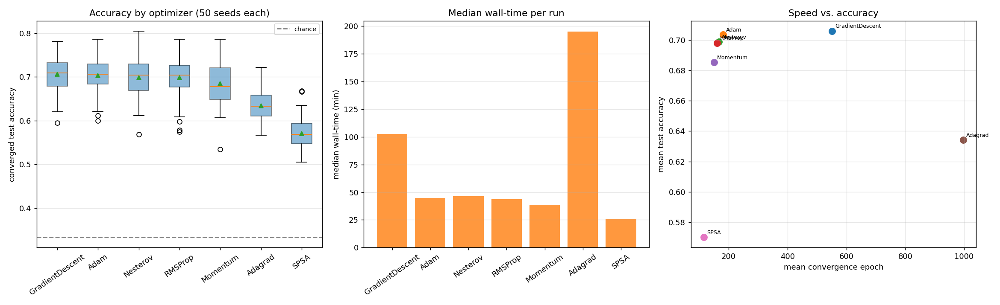

# Optimizer Benchmark Report — cemoid L=3, P=2

**Question:** Under our converged-training protocol, how do the available PennyLane
optimizers compare on the cemoid (L=3, P=2) tic-tac-toe task — in final accuracy,
convergence speed, and wall-time — and is Adam (our default) the right choice?

**Headline result:** Across **7 optimizers × 50 seeds = 350 runs**, the four
adaptive/accelerated first-order methods are **statistically tied** at the top:
GradientDescent 0.706, **Adam 0.704**, Nesterov 0.699, RMSProp 0.698 — none
differs significantly from Adam (Mann–Whitney p > 0.6). Plain GradientDescent
matches Adam's accuracy but needs **3× the epochs and ~2.3× the wall-time**, so
**Adam gives the best accuracy-per-compute** and remains the right default.
Adagrad **never converged** (0/50 hit the 1000-epoch cap, worst-but-one accuracy,
slowest) and the gradient-free **SPSA** is clearly the weakest (0.570, though still
well above the 0.333 chance level). The **QML-specific** optimizers (QNG,
MomentumQNG, QNSPSA, Rotosolve) are **infeasible** for this objective and are
excluded — see §4.

---

## 1. Methodology

### 1.1 What is held fixed vs. varied

This benchmark reuses the **exact converged-training protocol, data, model, and
splits** of the robustness study (`sweep.train_model`), changing **only the
optimizer**. For each of 50 seeds (0–49) and 7 optimizers, one independent training
run is performed (`optimizer_benchmark.py`).

- **Data** (identical to all other experiments): tic-tac-toe boards from
  `enumerate_valid_boards()` (5,478 unique), 3 classes (cross/circle/draw),
  class-balanced splits via `build_data_splits(seed=2027)` →
  train/val/test = 450/300/600, sampled with replacement, **data seed fixed 2027**.
- **Model:** cemoid L=3, P=2 = **54 trainable parameters**; 9 qubits; RX data
  re-upload; 9 PauliZ readout → argmax. PennyLane `default.qubit`, exact
  (`shots=None`), `diff_method="backprop"`.
- **Initialisation:** seed *s* → `default_rng(s).uniform(-0.05, 0.05, size=(6, 9))`
  (the same init scheme and the same 50 seeds for every optimizer, so comparisons
  are paired by seed).
- **Stopping (identical across optimizers):** validation-loss early stopping,
  `patience = 75`, `min_delta = 1e-4`, `max_epochs = 1000`, restore-best-weights;
  30 minibatch steps/epoch, batch size 15; reported metric = test accuracy at the
  best-validation epoch.

### 1.2 Optimizers and learning rate

All gradient-based optimizers use the project default **learning rate 0.03**
(SPSA uses its own internal perturbation schedule with `maxiter = max_epochs ×
steps_per_epoch`). Built via `make_opt()`:

| Optimizer | PennyLane class | Type |
|---|---|---|
| GradientDescent | `GradientDescentOptimizer` | vanilla first-order |
| Momentum | `MomentumOptimizer` | first-order + momentum |
| Nesterov | `NesterovMomentumOptimizer` | first-order + Nesterov momentum |
| Adagrad | `AdagradOptimizer` | adaptive per-parameter LR |
| RMSProp | `RMSPropOptimizer` | adaptive per-parameter LR |
| **Adam** (default) | `AdamOptimizer` | adaptive + momentum |
| SPSA | `SPSAOptimizer` | gradient-free (stochastic perturbation) |

**Learning rate is NOT individually tuned per optimizer** — every method runs at
the same lr 0.03 that Adam was set to. This is a deliberate apples-to-apples
"default-settings" comparison; a per-optimizer lr sweep (esp. for Adagrad/SPSA)
could shift the lower ranks and is left as future work.

### 1.3 Compute

**350-task SLURM array** (one (optimizer, seed) pair per task), Yale Bouchet HPC
(`day` partition, 8 CPUs / 12 GB per task), conda env `qml-ea` (PennyLane 0.45),
throttle `%150`, dependency-chained to start after the sweep and robustness jobs.
**SLURM job `16430208`.**

---

## 2. Results

### 2.1 Optimizer comparison (50 seeds each), ranked by mean accuracy

| Rank | Optimizer | Mean acc | Std | Median | Min–Max | Mean conv. epoch | Median wall (min) | Converged | MWU vs Adam |
|---|---|---:|---:|---:|---|---:|---:|---:|---:|
| 1 | GradientDescent | **0.706** | 0.044 | 0.709 | 0.595–0.782 | 551 | 102.5 | 46/50 | p = 0.77 (ns) |
| 2 | **Adam** (default) | 0.704 | 0.042 | 0.706 | 0.600–0.787 | 181 | 44.7 | 50/50 | — (baseline) |
| 3 | Nesterov | 0.699 | 0.049 | 0.704 | 0.568–0.805 | 167 | 46.5 | 50/50 | p = 0.75 (ns) |
| 4 | RMSProp | 0.698 | 0.047 | 0.704 | 0.575–0.787 | 160 | 43.6 | 50/50 | p = 0.62 (ns) |
| 5 | Momentum | 0.685 | 0.050 | 0.678 | 0.535–0.787 | 150 | 38.5 | 50/50 | p = 0.065 (ns) |
| 6 | Adagrad | 0.634 | 0.036 | 0.633 | 0.567–0.722 | 997 | 195.0 | **0/50** | p = 8×10⁻¹² *** |
| 7 | SPSA | 0.570 | 0.039 | 0.568 | 0.505–0.668 | 116 | 25.5 | 50/50 | p = 5×10⁻¹⁷ *** |

*MWU = two-sided Mann–Whitney U vs. Adam; "ns" = not significant at α = 0.05;
*** = p < 0.001. Chance accuracy ≈ 0.333; every optimizer beats it.*

### 2.2 Figure

- **Left:** accuracy box plots (50 seeds each), ordered by mean. The top five
  overlap heavily; Adagrad and SPSA sit clearly lower.
- **Middle:** median wall-time per run. GradientDescent (~102 min) and especially
  Adagrad (~195 min) are far more expensive than Adam/Nesterov/RMSProp (~44–47 min);
  SPSA is cheapest (~26 min) but least accurate.
- **Right:** speed (mean convergence epoch) vs. mean accuracy. Adam/Nesterov/RMSProp
  cluster in the high-accuracy, low-epoch sweet spot; GradientDescent reaches the
  same accuracy but at ~550 epochs; Adagrad is stranded at the epoch cap.

### 2.3 Key findings

1. **The top four are statistically tied.** GradientDescent (0.706), Adam (0.704),
   Nesterov (0.699) and RMSProp (0.698) are within 0.008 of each other, and none
   differs significantly from Adam (all MWU p > 0.6). At lr 0.03 on this 54-param
   landscape, the choice among these four does not change the accuracy you get.

2. **Adam wins on accuracy-per-compute.** GradientDescent edges Adam on raw mean
   (+0.002) but is not significantly better and pays heavily: **mean 551 vs 181
   convergence epochs** and **median 102.5 vs 44.7 min wall-time** (~2.3×). It also
   failed to converge in 4/50 runs (hit the epoch cap). Adam reaches the same
   accuracy ~2× faster and converged 50/50 — the best speed/quality trade-off.

3. **Momentum trails slightly.** Mean 0.685, just below the lead group; the
   difference vs. Adam is borderline (p = 0.065) and not significant at α = 0.05,
   but it is the weakest of the accelerated methods here.

4. **Adagrad fails under default settings.** **0/50 converged** — every run hit the
   1000-epoch cap (mean conv. epoch 997) and it was the slowest by far (~195 min/run)
   while landing the second-worst accuracy (0.634). Its monotonically shrinking
   per-parameter learning rate stalls progress long before the validation loss
   plateaus; it would likely need a much larger base lr to be competitive.

5. **SPSA is the floor.** As the only gradient-free method it is cheapest per run
   (~26 min) but clearly least accurate (0.570) — expected, since two-point
   stochastic gradient estimates are far noisier than the exact backprop gradients
   the other methods enjoy on this exact-statevector simulator. Still well above
   chance, so it *works*, just not competitively.

---

## 3. Recommendation

**Keep Adam (lr 0.03) as the default.** It is tied for the best accuracy, converges
about twice as fast as the only method that matches it (GradientDescent), and
converged on all 50 seeds. Nesterov and RMSProp are equally good drop-in
alternatives if ever needed. Avoid Adagrad and SPSA at these default settings.

*Caveat:* this is a fixed-lr (0.03) comparison. A per-optimizer learning-rate sweep
could rehabilitate Adagrad/SPSA and is the natural follow-up; it would not change
the headline that the adaptive-momentum methods are the strong, fast default.

---

## 4. Excluded: QML-specific optimizers (infeasible for this objective)

PennyLane's quantum-aware optimizers were probed (`optimizer_probe.py`) and found
**structurally incompatible** with our cost — they are not a tuning problem but an
interface mismatch:

| Optimizer | Why it cannot run here |
|---|---|
| **QNG**, **MomentumQNG** | Require the objective to be a **single QNode** and use the quantum **metric tensor**. Our cost is a classical MSE over 9 PauliZ expectations with **data re-uploading** (input-dependent metric) and **parameters shared across many gates** — there is no single-QNode metric tensor to compute. |
| **QNSPSA** | Same single-QNode/metric-tensor requirement (SPSA-approximated); fails in `compile_pipeline` on our composite cost. |
| **Rotosolve** | Needs each parameter's **frequency spectrum**; the shared-parameter structure (one angle driving many gates) does not expose a clean per-parameter spectrum. |
| **Rotoselect** | Reselects **gate types** during optimization — not applicable to our fixed cemoid ansatz. |
| **ShotAdaptive** | Requires `shots != None`; we use exact statevector (`shots=None`). |

Per project decision, these are **documented as infeasible, not re-engineered**
(re-architecting the cost into a single QNode to force QNG would change the model
being studied). `optimizer_probe.py` reproduces each failure.

---

## 5. Reproducibility

| Item | Path / value |
|---|---|
| Per-(optimizer, seed) results | `optimizer_histories/<optimizer>/seed_000.json … seed_049.json` (350 files) |
| Benchmark driver | `optimizer_benchmark.py` (`train`, `make_opt`) |
| Feasibility probe (QML opts) | `optimizer_probe.py` |
| Analysis + figure script | `analyze_results.py` (`analyze_optbench`) |
| Figure | `optimizer_benchmark_comparison.png` |
| Shared training/eval helpers | `sweep.py` |
| Dataset construction | `initial_program.py` (`enumerate_valid_boards`, `build_data_splits`) |
| Cluster job | SLURM array `16430208` (Bouchet, `qml-ea` env, `day` partition, `%150`) |
| Early stopping | monitor = validation L2 loss, patience = 75, min_delta = 1e-4, max_epochs = 1000, restore_best_weights = True |
| Learning rate | 0.03 (all gradient-based); SPSA internal schedule |
| Data seed (fixed) | 2027 · splits 450/300/600 (class-balanced, with replacement) |
| Seeds | 0–49 (same 50 for every optimizer; comparisons paired by seed) |
