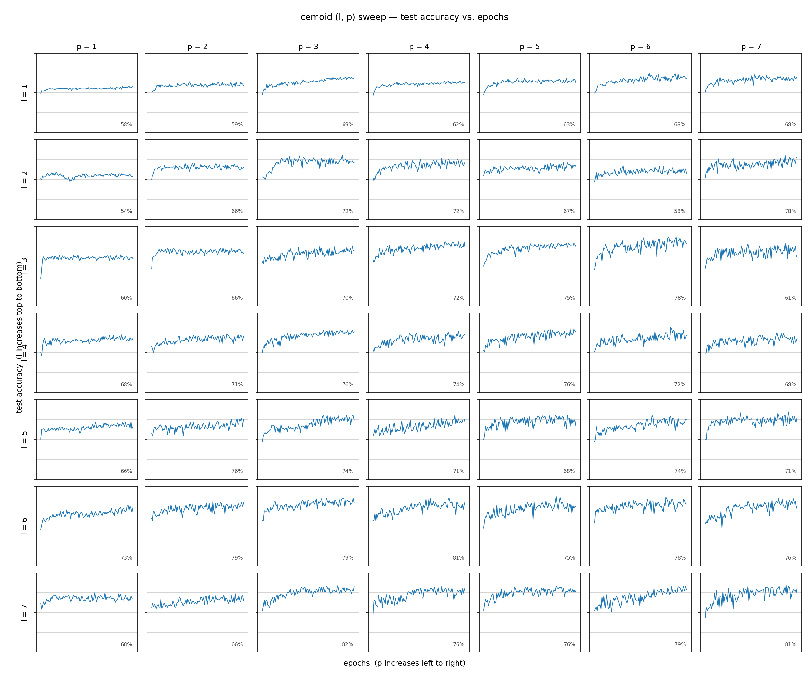
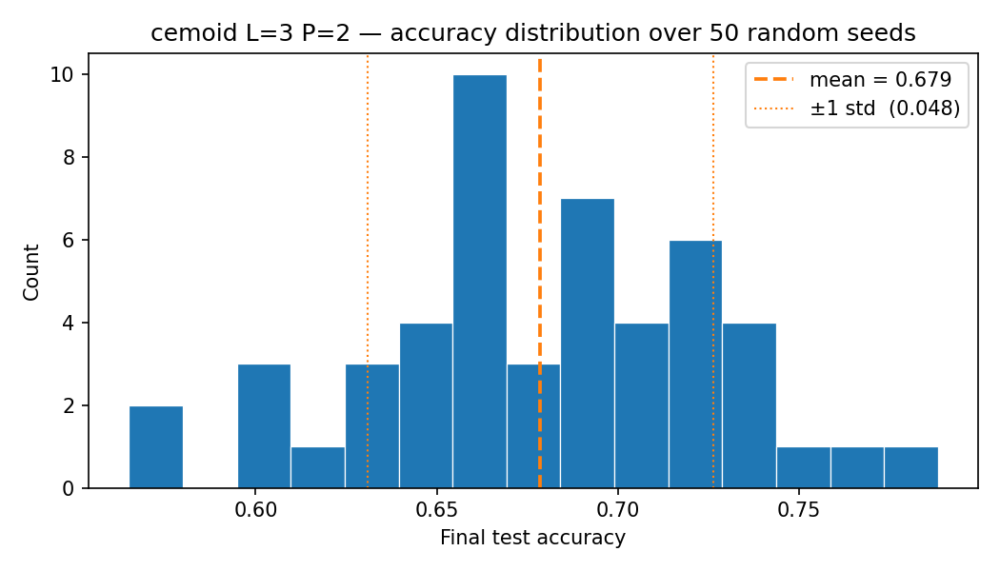
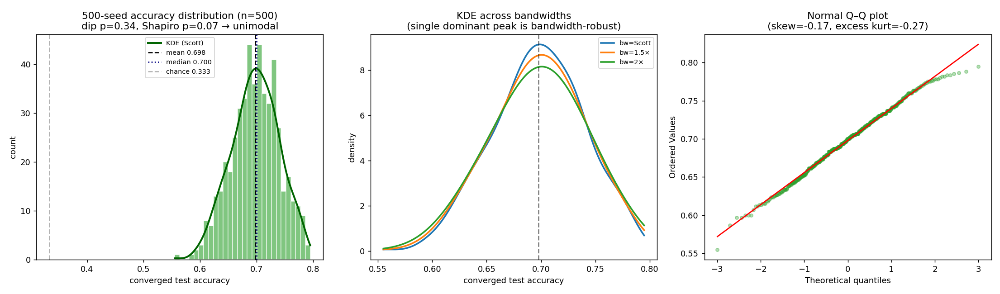
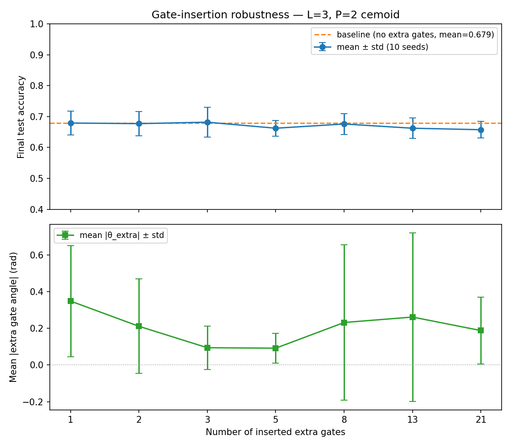
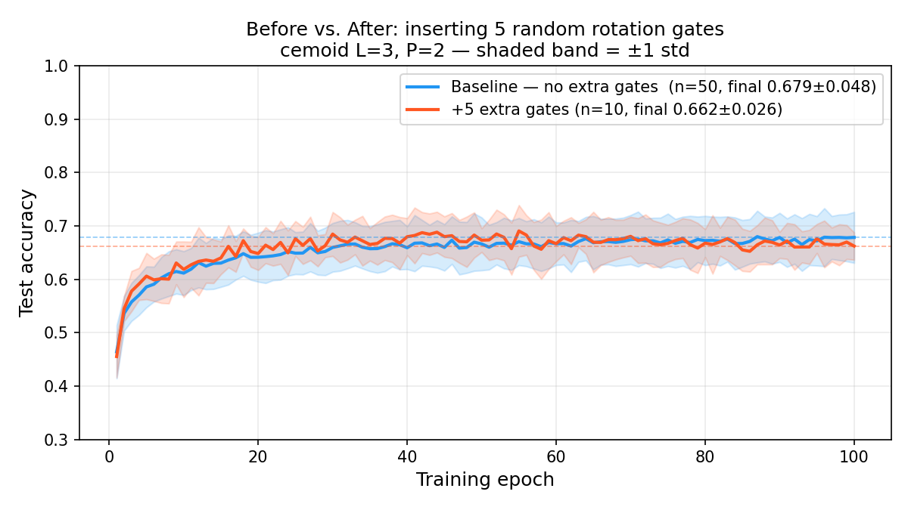
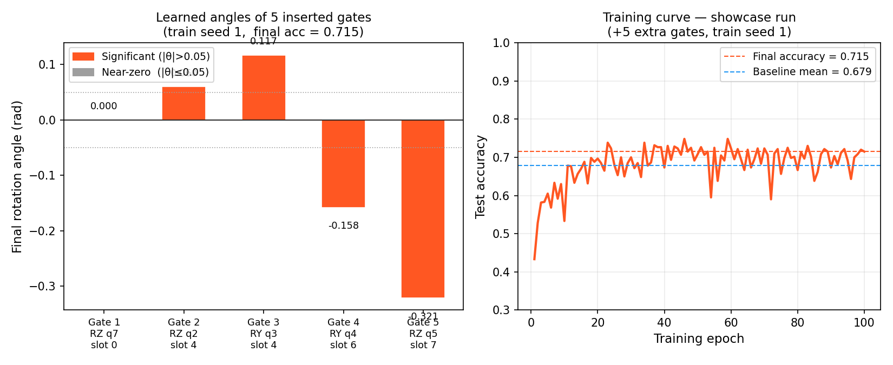
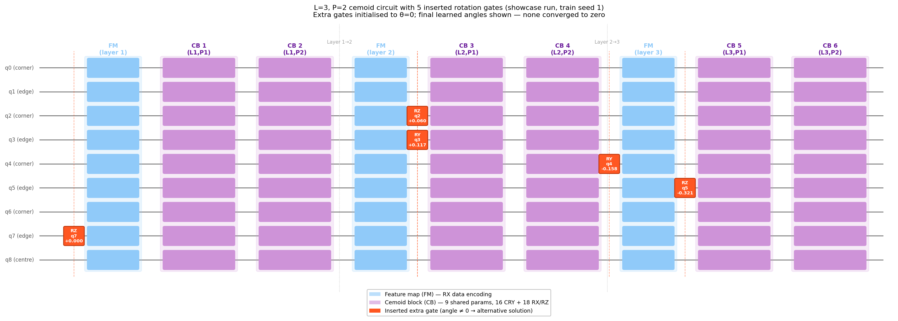

# Paper Replication Results Summary

**Model:** cemoid quantum classifier, **L = 3 layers, P = 2 cemoid-block repetitions**
**Task:** tic-tac-toe board classification (3-class)
**Base circuit:** 9 qubits, 6 cemoid blocks, **54 trainable gate parameters**
**Training:** Adam (lr = 0.03), 100 epochs × 30 steps, batch size 15; fixed data split (`DATA_SEED = 2027`)

This document consolidates the two robustness experiments performed on the
best L/P configuration identified by the evolutionary sweep:

1. **50-seed robustness** — how stable is the solution across random initialisations?
2. **Random gate insertion** — is the trained solution a unique global optimum, or one of many degenerate attractors?

It is preceded by the **L/P architecture sweep** that motivated the choice of configuration.

---

## Experiment 0 — L/P Architecture Sweep (1–7 × 1–7), agrees with [paper](https://www.alphaxiv.org/abs/2205.06217)

### Design
Before fixing a configuration, every combination of **L ∈ {1…7} layers** and
**P ∈ {1…7} cemoid-block repetitions** was trained once under identical
conditions (49 models). Each model records its full 100-epoch test-accuracy
trajectory; the final-epoch accuracy is reported.

### Final test accuracy grid (rows = L, cols = P)

| L \ P | P1 | P2 | P3 | P4 | P5 | P6 | P7 |
|---:|---:|---:|---:|---:|---:|---:|---:|
| **L1** | 0.580 | 0.590 | 0.687 | 0.625 | 0.630 | 0.683 | 0.677 |
| **L2** | 0.543 | 0.655 | 0.717 | 0.722 | 0.667 | 0.578 | 0.783 |
| **L3** | 0.595 | 0.663 | 0.700 | 0.725 | 0.748 | 0.782 | 0.612 |
| **L4** | 0.680 | 0.707 | 0.765 | 0.737 | 0.762 | 0.722 | 0.682 |
| **L5** | 0.662 | 0.758 | 0.743 | 0.713 | 0.675 | 0.745 | 0.707 |
| **L6** | 0.728 | 0.793 | 0.792 | 0.812 | 0.748 | 0.778 | 0.762 |
| **L7** | 0.682 | 0.655 | 0.825 | 0.765 | 0.760 | 0.792 | 0.810 |

| Metric | Value |
|---|---|
| Models trained | 49 (7 × 7) |
| Min / Max | 0.543 (L2,P1) / **0.825 (L7,P3)** |
| Selected config (L3,P2) | 0.663 |

Accuracy broadly increases with circuit depth (larger L and P), with the
strongest single runs in the L6–L7 band (up to 0.825). **L=3, P=2** (0.663) was
selected for the downstream robustness experiments as a compact, mid-range
configuration — large enough to classify well above chance, small enough
(54 parameters) to train cheaply across 50 seeds and 70 gate-insertion runs.

### Plot

*Final test accuracy across the full L = 1–7 × P = 1–7 grid.*

---

## Experiment 1 — 50-Seed Robustness

### Design
The fixed (L=3, P=2) circuit is trained **50 times**, each with a different RNG
seed for the initial gate parameters, while the data split is held constant.
Each run records the full 100-epoch test-accuracy trajectory; the final epoch
accuracy is the reported statistic.

### Statistics (n = 50)

| Metric | Value |
|---|---|
| Mean final test accuracy | **0.679** |
| Std (sample) | 0.048 |
| Median | 0.680 |
| Min / Max | 0.565 / 0.788 |
| Range | 0.223 |
| Best / worst seed | seed 21 (0.788) / seed 17 (0.565) |
| Fraction ≥ 0.65 | 76% |
| Fraction ≥ 0.70 | 34% |

Random-guess baseline for a 3-class task is ≈ 0.33, so all 50 runs are far
above chance. The ~0.048 spread shows the optimiser reliably reaches the
0.66–0.70 band but lands on different solutions of varying quality depending on
initialisation.

### Plot

*Distribution of final test accuracy across the 50 random seeds for the fixed L=3, P=2 cemoid circuit.*

### Update — 500-seed converged distribution

The numbers and plot above use the **superseded** fixed-100-epoch protocol. The
experiment was later rerun at **500 seeds** under the corrected
**validation-loss early-stopping (train-to-convergence)** protocol — mean
**0.698 ± 0.042** (vs. 0.679 ± 0.048), all 500/500 converged. At this resolution
the count-vs-accuracy distribution is **confirmed unimodal** (Hartigan dip
p = 0.34, Shapiro p = 0.071; the lone KDE peak is bandwidth-robust). Full
methodology, statistics, and the single-peak test are in
**`ROBUSTNESS_500SEED_REPORT.md`**.

*Left: count-vs-accuracy histogram (n = 500) with KDE — a single clean peak at
~0.70. Middle: KDE at three bandwidths, showing the dominant peak is
bandwidth-robust (no second mode). Right: normal Q–Q plot — near-Gaussian
(skew −0.17, excess kurtosis −0.27).*

---

## Experiment 2 — Random Gate Insertion

### Hypothesis
> If the trained L=3, P=2 solution is a strict global optimum, any extra
> rotation gate inserted anywhere — initialised at angle **0** (a perfect
> no-op) — should stay at 0 under gradient descent.

If the learned angles drift **away from zero**, the loss landscape contains
other equally good attractors and the solution is not unique.

### Design
- **Slot skeleton:** 10 insertion slots × 9 qubits × 3 rotation types (RX/RY/RZ) = **270 candidate positions**.
- For each gate count **N ∈ {1, 2, 3, 5, 8, 13, 21}**, N positions are drawn at random with a **fixed config seed = 42**, so the inserted topology is identical across all training seeds.
- Extra-gate angles always start at exactly 0; cemoid parameters use **10 independent training seeds** (0–9) per gate count.
- All parameters (cemoid + extra) are optimised jointly. **70 runs total** (7 gate counts × 10 seeds).

### Statistics (10 runs per gate count)

| Extra gates N | Mean acc | Std | Min | Max | Mean \|θ_extra\| (rad) | Std \|θ\| |
|---:|---:|---:|---:|---:|---:|---:|
| 1  | 0.679 | 0.041 | 0.620 | 0.763 | 0.349 | 0.320 |
| 2  | 0.677 | 0.042 | 0.622 | 0.750 | 0.212 | 0.165 |
| 3  | 0.682 | 0.051 | 0.602 | 0.767 | 0.095 | 0.064 |
| 5  | 0.662 | 0.027 | 0.625 | 0.715 | 0.092 | 0.033 |
| 8  | 0.676 | 0.035 | 0.620 | 0.727 | 0.232 | 0.166 |
| 13 | 0.662 | 0.035 | 0.582 | 0.708 | 0.262 | 0.164 |
| 21 | 0.658 | 0.029 | 0.613 | 0.695 | 0.188 | 0.053 |
| **pooled (70)** | **0.671** | **0.037** | — | — | — | — |

**Baseline (50 seeds, no extra gates): mean 0.679, std 0.048.**

### Significance vs. baseline (Welch t-test)

| N | Δacc vs baseline | t | Significant? |
|---:|---:|---:|:--:|
| 1 | +0.001 | −0.04 | no |
| 2 | −0.001 | +0.09 | no |
| 3 | +0.003 | −0.19 | no |
| 5 | −0.016 | +1.48 | no |
| 8 | −0.003 | +0.20 | no |
| 13 | −0.016 | +1.26 | no |
| 21 | −0.021 | +1.86 | no |
| pooled | −0.008 | +0.94 | no |

All |t| < 2 → **no statistically significant accuracy change** from adding up to
21 free parameters.

### Plots

*Top: mean test accuracy vs. number of inserted gates (flat, near baseline). Bottom: mean absolute extra-gate angle (consistently 0.09–0.35 rad, never zero).*

*Full 100-epoch trajectories: baseline (n=50) vs +5 extra gates (n=10) converge along nearly identical paths.*

*A single high-performing +5-gate run (train seed 1, final acc 0.715). Four of the five inserted gates learn non-trivial angles (|θ| > 0.05 rad).*

*L=3, P=2 cemoid circuit with the 5 inserted gates highlighted; learned angles annotated.*

---

## Key Findings

| Question | Finding |
|---|---|
| Is the solution stable across seeds? | Yes — 0.679 ± 0.048, all 50 runs well above chance (0.33). |
| Does accuracy hold with extra gates? | Yes — 0.658–0.682 across 1–21 gates; no significant change (all \|t\| < 2). |
| Do inserted gates converge to zero? | **No** — mean \|θ\| = 0.09–0.35 rad, well above zero. |
| Is the trained solution uniquely optimal? | **No** — gates initialised at 0 drift to non-zero values, indicating degenerate attractors / flat directions in the landscape. |
| Practical robustness for NISQ hardware? | Yes — the circuit absorbs extra free parameters without performance loss. |

**Interpretation.** The two experiments are complementary. The seed sweep shows
the optimiser reaches a consistent accuracy band from many starting points; the
gate-insertion sweep shows those endpoints are *not* a single global minimum but
a family of equivalent solutions connected by flat directions. The model is
robust and expressive, but the specific gate angles of any single trained
instance should not be over-interpreted as physically meaningful.

---

## 07-03 meeting follow-up (cemoid track)

Four subtasks from `../meeting-notes-07-03.md`, all run on Bouchet (720 tasks, 0 failures).
Together they **revise Experiment 2's reading**: the inserted-gate drift reported above is
an artifact of continued training along a degenerate flat direction, not evidence that
added gates capture unexploited capacity.

| Subtask | Report | Headline |
|---|---|---|
| Rotation-angle magnitude baseline | `ANGLE_MAGNITUDE_REPORT.md` | Original angles are O(1 rad) (mean 0.824); inserted gates sit at 0.039 rad, median exactly 0 — **21× smaller**. |
| Joint no-gate control | `JOINT_NOGATE_BASELINE_REPORT.md` | Extra training with **no gates** drifts 0.0202 rad vs joint's 0.0380 — **indistinguishable (p = 0.20)**. Drift is not gate-caused. |
| Perturbation stability | `PERTURBATION_STABILITY_REPORT.md` | Optimizer pulls injected noise onto an **absolute floor** (~0.05–0.09 rad) for any r ≤ 1.0; ε-ball boundary at **r ≈ 0.5–1.0 rad**. |
| Degeneracy / latent-space PCA | `DEGENERACY_PCA_REPORT.md` | Median effective dimensionality **1.15 of 54**. The ansatz is over-parameterised ~47×. |

**Superseded claim.** Row 4 of *Key Findings* above ("Is the trained solution uniquely
optimal? **No** — gates drift to non-zero values") reached the right conclusion for the
wrong reason. The correct statement is: the solution is **not unique because the loss
landscape is degenerate along ~1 flat direction**, and the observed gate drift is a
symptom of that degeneracy plus continued training — not an independent measurement of it.
Under the frozen protocol, gates initialised at 0 stay at 0 (median |θ| = 0.000) and buy
no accuracy.

---

## Reproducibility

| Item | Path |
|---|---|
| 07-03 follow-up: status / fetch | `bash cluster/deploy_and_run.sh meeting-{status,fetch}` |
| Joint no-gate raw results | `joint_nogate_results/base_{00-09}.json` |
| Perturbation raw results | `perturbation_results/{random_gate,nearzero_gate,delta_weight}/r*_base*.json` |
| Degeneracy raw results | `degeneracy_results/**/*.json` (500) |
| Base optima (shared starting points) | `base_optima/seed_{00-09}.json` |
| L/P sweep raw histories | `histories/history_l{1-7}_p{1-7}.json` |
| L/P sweep script | `sweep.py` |
| 50-seed raw histories | `robustness_histories/seed_000.json … seed_049.json` |
| Gate-insertion raw results | `gate_insertion_results/ng{N}_cs042_ts{0-9}.json` |
| Seed-sweep script | `seed_robustness.py` |
| Gate-insertion script | `gate_insertion.py` |
| Figure-generation script | `make_report_figures.py` |
| Detailed write-up (incl. pending EA-circuit comparison) | `gate_insertion_report.md` |

*Statistics in this summary were recomputed directly from the raw JSON result
files. The EA-evolved-circuit comparison (Section 6 of `gate_insertion_report.md`)
is still pending cluster completion — `ea_robustness_histories/` is currently empty.*
