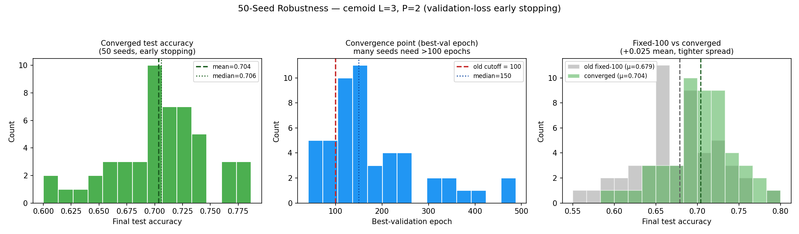

# 50-Seed Robustness Report — cemoid L=3, P=2

**Question:** How stable is the trained cemoid (L=3, P=2) tic-tac-toe classifier
across random parameter initialisations, when each model is trained **to
convergence** rather than for a fixed epoch budget?

**Headline result:** Across 50 independent seeds, converged test accuracy is
**0.704 ± 0.042** (mean ± sample std), median 0.706, range 0.600–0.787. All 50
runs converged via validation-loss early stopping (none hit the epoch cap or
walltime). This is **+0.025 higher and tighter** than the previous fixed-100-epoch
protocol (0.679 ± 0.048), which stopped most seeds before convergence.

---

## 1. Methodology

### 1.1 Data source

The dataset is generated programmatically from the rules of tic-tac-toe
(`initial_program.py`), not loaded from disk:

- **Board enumeration.** `enumerate_valid_boards()` performs a depth-first
  expansion of all legal play sequences (cross moves first), recording every
  unique board state reached. Recursion stops as soon as a player wins or the
  board fills, so post-win positions are excluded. Intermediate non-terminal
  positions are kept. This yields **5,478 unique legal board states**.
- **Labels (3 classes).** Each board is labelled by `board_label()`:
  `cross` (cross has 3-in-a-row), `circle` (circle has 3-in-a-row), or `draw`
  (everything else — full boards with no winner *and* unfinished positions).
  The natural class distribution is highly imbalanced:

  | Class | Unique boards |
  |---|---:|
  | cross | 626 |
  | circle | 316 |
  | draw | 4,536 |
  | **total** | **5,478** |

- **Board encoding.** A board is a length-9 vector with entries +1 (cross),
  −1 (circle), 0 (empty), indexed by the paper's grid layout. Each value feeds
  qubit *i* through an RX rotation scaled by `FEATURE_SCALE = 2π/3`.
- **Label vectors.** Targets are ±1 one-hot triples: cross `[+1,−1,−1]`,
  circle `[−1,+1,−1]`, draw `[−1,−1,+1]`.

### 1.2 Train / validation / test splits

`build_data_splits(seed=2027)` draws three **class-balanced** splits via
`make_balanced_split()` — each class contributes an equal number of boards
(size / 3), sampled with `numpy` `default_rng(2027)`:

| Split | Size | Per class | Purpose |
|---|---:|---:|---|
| Train | 450 | 150 | gradient updates |
| Validation | 300 | 100 | early-stopping signal + model selection |
| Test | 600 | 200 | held-out reporting only |

**Data seed is fixed at 2027 for all 50 runs** — every seed trains on the
*same* data; only the model's initial parameters differ. Because the `circle`
class has just 316 unique boards, sampling is done **with replacement** to keep
the paper's balanced split sizes, so there can be repeated/overlapping boards
across splits (an inherent limitation of the small board space, not a choice of
this experiment).

### 1.3 Model

The cemoid ansatz at **L = 3 layers, P = 2 cemoid-block repetitions**:

- 9 qubits arranged on the tic-tac-toe grid.
- Each layer = one RX feature-map (data re-upload) followed by 2 cemoid blocks.
- Each cemoid block carries **9 shared trainable parameters** (corner/edge/center
  RX+RZ angles and three CRY coupling angles).
- Total: 3 × 2 × 9 = **54 trainable parameters**.
- Readout: 9 PauliZ expectations mapped to [cross, circle, draw]; argmax = prediction.
- Simulated with PennyLane `default.qubit`, exact (`shots=None`), `diff_method="backprop"`.

### 1.4 Training protocol & stopping criteria

- **Optimiser:** Adam, learning rate 0.03.
- **Epoch:** 30 minibatch gradient steps, batch size 15 (the train set reshuffled
  each epoch).
- **Loss:** mean squared error between the 3-vector prediction and the ±1 target.
- **Stopping criterion — validation-loss early stopping with restore-best-weights:**
  - After every epoch, evaluate the **L2 loss on the validation set**.
  - Track the lowest validation loss seen. An epoch counts as an improvement only
    if it beats the best by at least **`min_delta = 1e-4`**.
  - If **`patience = 75`** consecutive epochs pass with no improvement, stop.
  - **Hard cap:** `max_epochs = 1000` (safety; never reached here).
  - **Soft walltime cap:** ~23.3 h, to write a partial result instead of being
    killed (never triggered here).
  - **Restore best weights:** the parameters from the lowest-validation-loss
    epoch are restored as the final model.
- **Reported metric:** `final_test_accuracy` is the **test accuracy at the
  restored best-validation epoch**. The test set is never used for any training
  or stopping decision — model selection is driven entirely by validation loss.

### 1.5 Compute

Run as a 50-task SLURM array (one seed per task) on the Yale Bouchet HPC cluster
(`day` partition, 8 CPUs / 12 GB per task), conda env `qml-ea`
(PennyLane 0.45). SLURM job `16408760`.

---

## 2. Results

### 2.1 Statistics (n = 50)

| Metric | Value |
|---|---|
| Mean test accuracy | **0.704** |
| Std (sample) | 0.042 |
| Median | 0.706 |
| IQR (Q1–Q3) | 0.683 – 0.730 |
| Min / Max | 0.600 / 0.787 |
| Range | 0.187 |
| Mean validation accuracy | 0.729 |
| Best seed | seed 21 → 0.787 (best epoch 166) |
| Worst seed | seed 29 → 0.600 (best epoch 180) |
| Fraction ≥ 0.65 | 88% |
| Fraction ≥ 0.70 | 58% |
| Converged via early stopping | **50 / 50 (100%)** |

Random-guess accuracy for a balanced 3-class task is ≈ 0.333, so all 50 runs are
far above chance. With training carried to convergence the optimiser reliably
reaches the **0.68–0.73** band, with a long lower tail down to 0.60 from a few
unlucky initialisations.

### 2.2 Convergence behaviour

| Metric | Value |
|---|---|
| Best-validation epoch — mean / median | 180.7 / 150 |
| Best-validation epoch — min / max | 41 / 488 |
| Stopped epoch — mean | 255.7 |
| Stopped epoch — min / max | 116 / 563 |

The **median converged at epoch 150 and several seeds needed up to ~490 epochs** —
well beyond the old fixed cutoff of 100. This is the direct evidence that the
previous protocol stopped training prematurely.

### 2.3 Figure

- **Left:** distribution of converged test accuracy across the 50 seeds (mean 0.704, median 0.706).
- **Middle:** distribution of the best-validation (convergence) epoch. The red line marks the old fixed cutoff of 100 — the vast majority of seeds converge *after* it (median 150).
- **Right:** old fixed-100-epoch distribution (grey) vs. converged distribution (green); the converged distribution shifts right by +0.025 and is tighter.

### 2.4 Methodology comparison

| Protocol | n | Mean | Std | Median | Min | Max |
|---|---:|---:|---:|---:|---:|---:|
| Old — fixed 100 epochs | 50 | 0.679 | 0.048 | 0.680 | 0.565 | 0.788 |
| **New — converged (early stopping)** | 50 | **0.704** | **0.042** | 0.706 | 0.600 | 0.787 |
| Δ (new − old) | | **+0.025** | −0.006 | +0.026 | | |

Training to convergence raises mean test accuracy by **+0.025**, lifts the
fraction of seeds reaching ≥ 0.70 from 34% to **58%**, and *reduces* the
seed-to-seed standard deviation — i.e. the model is both better and more
reproducible than the fixed-epoch protocol suggested.

---

## 3. Conclusions

1. **The cemoid L=3, P=2 classifier is robust to initialisation.** Trained to
   convergence, 50/50 seeds land between 0.60 and 0.79 (mean 0.704, std 0.042),
   all far above the 0.33 chance level; 88% reach ≥ 0.65.

2. **The old fixed-100-epoch protocol was under-training.** Median convergence is
   at epoch 150 (max 488), so the 100-epoch cutoff truncated most runs before
   their best validation point. Correcting this raises accuracy and lowers
   variance.

3. **Validation-driven early stopping is the right protocol** for this model:
   it reaches convergence per-seed without a hand-tuned epoch budget, and the
   reported test accuracy is selected by validation loss (no test-set leakage).

---

## 4. Reproducibility

| Item | Path / value |
|---|---|
| Converged per-seed results | `robustness_histories/seed_000.json … seed_049.json` |
| Old fixed-100 results (for comparison) | `_epoch100_backup/robustness_histories/` |
| Training/evaluation code | `sweep.py` (`train_model`) |
| Seed-sweep driver | `seed_robustness.py` |
| Dataset construction | `initial_program.py` (`enumerate_valid_boards`, `build_data_splits`) |
| Figure | `robustness_converged_distribution.png` |
| Cluster job | SLURM array `16408760` (Bouchet, `qml-ea` env) |
| Early stopping | monitor = validation L2 loss, patience = 75, min_delta = 1e-4, max_epochs = 1000, restore_best_weights = True |
| Data seed (fixed) | 2027 · splits train/val/test = 450 / 300 / 600 (class-balanced) |
