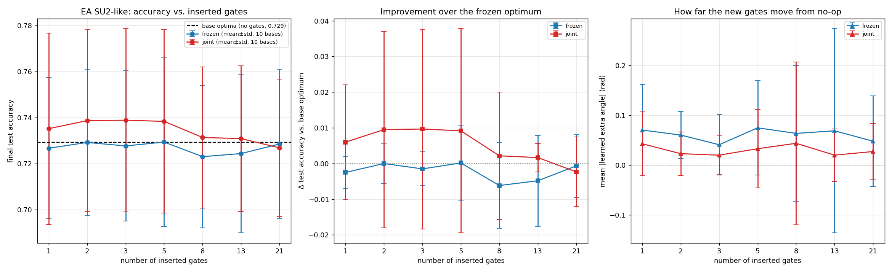

# Frozen-Original Gate-Insertion — evolved SU2-like ansatz (L=3, P=2)

**Date:** 2026-07-01
**Cluster jobs:** SLURM arrays `16769530` (base optima, 0–9) → `16769531`
(insertion, 0–139, `afterok`), Yale Bouchet `day` partition — all `COMPLETED`
**Data:** `paper-replication/base_optima_ea/` (10) · `gate_insertion_frozen_ea_results/{frozen,joint}/` (140)

**Question:** Take an **evolved SU2-like** (L=3, P=2) classifier **trained to
convergence** — an *optimal solution*. **Freeze** its 66 rotation angles. Now insert
extra rotation gates (initialised to a perfect no-op) and train **only the new
gates' angles**, leaving every original angle fixed. Can the added gates improve
the model, and how far do their angles move from zero? This mirrors the cemoid
frozen gate-insertion test (`GATE_INSERTION_FROZEN_REPORT.md`) on the EA winner.

**Headline result.** Freezing a converged evolved optimum and training added gates
yields **no accuracy improvement at any gate count** (frozen Δ test accuracy =
**−0.0022 ± 0.0094** across all 70 runs, i.e. statistically zero and slightly
negative), and the new gates **barely leave their no-op start** (median learned
|θ| = **0.024 rad**; mean 0.058; only 20% of inserted gates exceed 0.1 rad). The
frozen-optimality hypothesis is **supported**: the converged L=3, P=2 evolved
solution is a *constrained optimum* — no single added gate, with originals fixed,
improves it. The *joint* control (re-optimising the 66 originals too) recovers only
a marginal **+0.0051 ± 0.0215** — indistinguishable from zero within its own
spread. As with cemoid, gate insertion is **not** a useful fine-tuning lever for an
already-converged model; raising accuracy requires structural capacity, not bolted-on gates.

---

## 1. Motivation & hypothesis

A converged evolved solution lives in a 66-dimensional parameter space. Inserting a
new rotation gate adds a *new* axis the original optimisation never saw. At a
genuinely "complete" optimum, opening that one extra direction — **with the
originals held fixed** — should buy nothing: the new angle should sit at ≈ 0 (its
no-op start) and accuracy should not change.

> **Frozen-optimality hypothesis.** With the 66 original angles fixed at their
> converged values, training an inserted gate from θ = 0 leaves θ ≈ 0 and leaves
> test accuracy unchanged. Movement away from 0 *with an accuracy gain* would mean
> the frozen ansatz left unexploited capacity the added gate captures without any
> help from the originals.

**Why the frozen test is well-posed.** Because each inserted gate starts at θ = 0,
the augmented circuit at initialisation reproduces the base optimum *exactly* (same
validation loss, same accuracy). Combined with restore-best-weights on validation
loss, the frozen condition can therefore **never do worse** than the base optimum —
its validation loss can only stay equal or improve. So any reported Δaccuracy is a
clean measure of constrained improvement, not initialisation noise.

---

## 2. Methodology

### 2.1 Data source

Generated programmatically from the rules of tic-tac-toe (`initial_program.py`):

- `enumerate_valid_boards()` depth-first expands all legal play sequences (cross
  first), stopping at a win or full board → **5,478 unique legal boards**.
- 3 classes via `board_label()`: `cross` (626) / `circle` (316) / `draw` (4,536).
- Encoding: length-9 vector, +1/−1/0 per cell; value *i* → qubit *i* via RX scaled
  by `FEATURE_SCALE = 2π/3`. Labels are ±1 one-hot triples.

### 2.2 Splits

`build_data_splits(seed=2027)` — class-balanced, `default_rng(2027)`:

| Split | Size | Per class | Purpose |
|---|---:|---:|---|
| Train | 450 | 150 | gradient updates |
| Validation | 300 | 100 | early-stopping signal + model selection |
| Test | 600 | 200 | held-out reporting only |

Data seed fixed at 2027 throughout; `circle` undersampling forces sampling with
replacement to keep balanced sizes.

### 2.3 The three-step protocol

**Step 1 — obtain optimal solutions (base optima).** Train the base L=3, P=2
evolved circuit (66 params, no extra gates) to convergence under validation-loss
early stopping (patience 75, min_delta 1e-4, max_epochs 1000, restore-best-weights;
Adam lr 0.03, 30 steps/epoch, batch 15). Done for **10 independent initialisation
seeds (0–9)**; the 66 converged angles of each are saved
(`base_optima_ea/seed_NN.json`). These 10 serve as the fixed "optimal solutions."

**Step 2 — insert gates.** For each base optimum and each gate count
**N ∈ {1, 2, 3, 5, 8, 13, 21}**, draw N distinct insertion positions without
replacement from the **270 possible positions** (10 circuit slots × 9 qubits ×
{RX, RY, RZ}), using `config_seed = 1000 + base_seed` (positions reproducible, vary
across the 10 bases, and identical between the two conditions below). Each inserted
gate gets its own trainable angle, initialised to **exactly 0** (perfect no-op).

  *Slot layout (L=3, P=2 → 10 slots):* before/after every feature-map and evolved
  block in each of the 3 layers, plus a trailing slot.

**Step 3 — optimise, two conditions** (same early-stopping protocol as Step 1):

| Condition | Original 66 angles | Inserted gate angles | Question it answers |
|---|---|---|---|
| **frozen** *(the requested experiment)* | **fixed** at the optimum | trained (from 0) | Can added gates improve a *frozen* optimum? |
| **joint** *(control)* | trainable (start at optimum) | trained (from 0) | How much does *re-optimising the originals too* add on top? |

The reported `final_test_accuracy` is the test accuracy at the restored
best-validation epoch; `delta_test_acc` is relative to that base optimum's own test
accuracy (the no-op state).

### 2.4 Metrics recorded per run

- `final_test_accuracy` and **Δ test accuracy** vs. the frozen base optimum;
- `delta_val_loss` (≤ 0 by construction in the frozen condition);
- **mean and max |learned extra angle|** (how far the new gates leave no-op);
- `block_abs_change_mean` (joint only — how far the 66 originals moved);
- convergence epoch, stop reason.

### 2.5 Compute

Two dependency-chained SLURM arrays on the Yale Bouchet HPC cluster (`day`
partition, 4 CPUs / task), conda env `qml-ea` (PennyLane 0.45):

- **Stage A — `16769530`** (array 0–9): the 10 base optima.
- **Stage B — `16769531`** (array 0–139, `afterok:16769530`): 2 conditions × 7 gate
  counts × 10 bases = 140 insertion runs.

All 150 tasks `COMPLETED` (exit 0). Scripts: `gate_insertion_frozen_ea.py`,
`cluster/su2_frozen_base_array.sbatch`, `cluster/su2_frozen_insert_array.sbatch`.

---

## 3. Results

### 3.1 The base optima (the fixed "optimal solutions")

The 10 base L=3, P=2 evolved circuits all converged via validation-loss early
stopping (10/10), with **test accuracy 0.729 ± 0.034** (range 0.663–0.777, median
best-epoch 125). These match the evolved 500-seed robustness distribution
(0.730 ± 0.041) exactly, as expected — they are 10 converged draws from it. Each
contributes its 66 converged angles as one frozen optimum.

### 3.2 Per-gate-count summary (10 base optima each)

| Cond. | N gates | acc | Δacc vs base | mean \|θ\| (rad) | Δval-loss |
|---|---:|---:|---:|---:|---:|
| **frozen** | 1 | 0.727 | **−0.003** | 0.070 | −0.0008 |
| **frozen** | 2 | 0.729 | +0.000 | 0.060 | −0.0008 |
| **frozen** | 3 | 0.728 | −0.002 | 0.041 | −0.0009 |
| **frozen** | 5 | 0.729 | +0.000 | 0.075 | −0.0024 |
| **frozen** | 8 | 0.723 | −0.006 | 0.063 | −0.0021 |
| **frozen** | 13 | 0.724 | −0.005 | 0.069 | −0.0027 |
| **frozen** | 21 | 0.729 | −0.001 | 0.048 | −0.0017 |
| joint | 1 | 0.735 | +0.006 | 0.043 | −0.0028 |
| joint | 2 | 0.739 | +0.010 | 0.023 | −0.0130 |
| joint | 3 | 0.739 | +0.010 | 0.020 | −0.0130 |
| joint | 5 | 0.738 | +0.009 | 0.033 | −0.0135 |
| joint | 8 | 0.731 | +0.002 | 0.043 | −0.0063 |
| joint | 13 | 0.731 | +0.002 | 0.020 | −0.0004 |
| joint | 21 | 0.727 | −0.002 | 0.027 | −0.0014 |

### 3.3 Pooled statistics

| Quantity | **frozen** (70 runs) | joint (70 runs) |
|---|---:|---:|
| Final test accuracy (mean) | 0.727 | 0.734 |
| **Δ test accuracy vs base** | **−0.0022 ± 0.0094** | +0.0051 ± 0.0215 |
| Δacc range (min / max) | −0.038 / +0.025 | −0.030 / +0.095 |
| Runs improving acc (>0.001) / hurting (<−0.001) | 17% / 36% | 19% / 11% |
| Learned \|θ\| — mean / **median** / max | 0.058 / **0.024** / 2.28 | 0.028 / 0.000 / 1.42 |
| Fraction of inserted gates with \|θ\| > 0.1 | 20.2% | 11.3% |
| Mean Δ validation loss | −0.0016 | −0.0072 |
| Mean \|Δ\| of the 66 *original* angles | 0 (fixed) | 0.054 |

### 3.4 Figure

- **Left — accuracy vs. N.** The frozen curve sits **on the base-optima line**
  (dashed, 0.729) at every gate count; joint hovers a hair above within error.
  Adding 1→21 tunable gates does not move accuracy.
- **Middle — Δaccuracy over the frozen optimum.** Frozen hugs zero (slightly
  negative, −0.006…+0.000); joint sits marginally positive at N=1–5 (re-optimising
  the originals shaves a little validation loss) then decays to zero by N=21. No
  condition shows a sustained positive trend.
- **Right — how far the new gates move.** Mean |θ| stays in the **0.02–0.08 rad**
  band for both conditions. The frozen median is 0.024 rad and joint's is exactly 0:
  most inserted gates are restored to (or near) their no-op state.

## 4. Interpretation

**1. The converged evolved optimum is a constrained optimum (hypothesis
supported).** With the 66 original angles frozen, no number of added gates (1→21)
improves test accuracy — Δacc is statistically zero and slightly negative
(−0.0022 ± 0.0094), and the validation loss they can shave off is negligible (mean
−0.0016). The optimum has no accessible downhill direction along added single-gate
axes. The evolved model is genuinely *trained out* at L=3, P=2: the limit is the
ansatz's capacity, not unconverged training.

**2. Most inserted gates stay at (or near) no-op.** The **median learned |θ| is
0.024 rad** — because restore-best-weights returns a gate toward θ = 0 whenever
moving it fails to beat the base validation loss. The non-zero mean (0.058) is
driven by a ~20% minority of gates that wander (a few up to ~2.3 rad). Those wanders
are **accuracy-neutral**: the runs where gates move are not the runs where accuracy
rises (17% of frozen runs nudge accuracy up, 36% down — a slight net drag, not a gain).

**3. Re-optimising the originals (joint) barely helps.** Starting joint optimisation
*from* the converged optimum, with extra capacity, yields only Δacc ≈ +0.0051
(within its own ±0.0215 spread, i.e. not significant). Joint reduces validation loss
more than frozen (−0.0072 vs −0.0016, since it has 66 + N free params and moves the
originals by mean 0.054 rad) but that extra fitting **does not reliably transfer to
the test set** — the clean signature of a well-converged optimum sitting near the
model's generalisation ceiling.

**4. Same conclusion as cemoid, at a higher accuracy anchor.** The cemoid frozen
test found Δacc = −0.0003 ± 0.0073 around a 0.697 base; the evolved test finds
−0.0022 ± 0.0094 around a **0.729** base. Both say the converged optimum is a
constrained optimum with only accuracy-neutral flat directions along added gates.
The evolved ansatz simply anchors that same "you can't decorate your way to more
accuracy" result at a ~+0.03 higher operating point.

**5. Practical takeaway.** Gate insertion is **not** a useful fine-tuning lever for
an already-converged evolved model: freezing the optimum and bolting on trainable
rotations buys nothing. To raise accuracy one must **add structural capacity and
train it in** — though the companion SU2-like L/P sweep shows that, for this
heavily weight-shared block, even that has weak and eventually *negative* returns
past ~600 params. Decorating a finished model is a dead end either way.

## 5. Reproducibility

| Item | Path / value |
|---|---|
| Base optima (incl. saved 66 angles) | `base_optima_ea/seed_00.json … seed_09.json` |
| Insertion results | `gate_insertion_frozen_ea_results/{frozen,joint}/ngNN_baseNN.json` (140 files) |
| Experiment code | `gate_insertion_frozen_ea.py` (reuses `sweep_ea.py` / `sweep.py`) |
| Figure | `gate_insertion_frozen_ea_analysis.png` |
| Evolved ANSATZ_SPEC | `EA_CONVERGED_RERUN_REPORT.md` Appendix D (program `b6ba28a0…`, gen 16) |
| Cluster jobs | base optima `16769530`, insertion `16769531` (Bouchet, `qml-ea`, `day`, 4 CPUs/task) |
| Early stopping | val L2 loss, patience 75, min_delta 1e-4, max_epochs 1000, restore-best |
| Data seed | 2027 · splits 450/300/600 (class-balanced, with replacement) |
| Base init per seed *s* | `default_rng(s)` small-angle near-identity (±0.05), seeds 0–9 |
| Insertion positions | `config_seed = 1000 + base_seed`, N drawn from 270 positions |
| Inserted-gate init | θ = 0 (no-op); only these trained in the **frozen** condition |
