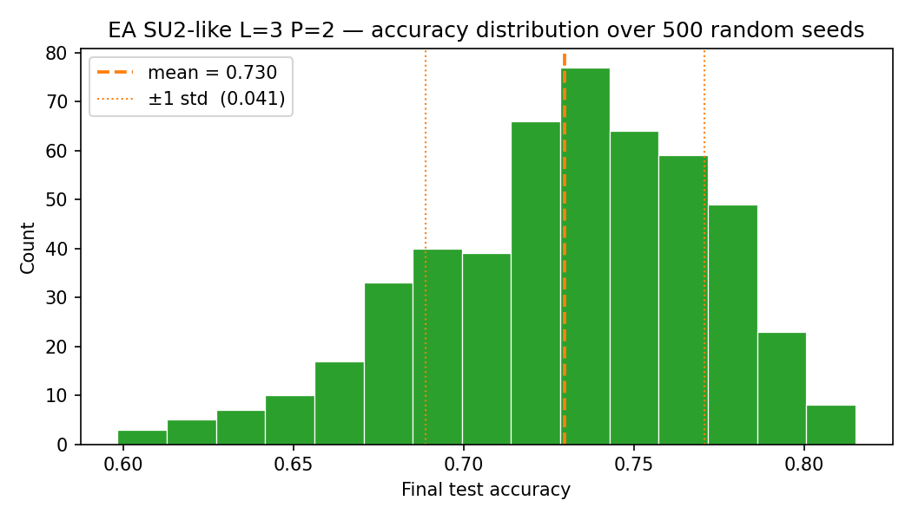

# 500-Seed Robustness — evolved SU2-like ansatz (L=3, P=2)

**Date:** 2026-07-01
**Cluster job:** SLURM array `16769502` (Yale Bouchet, `day` partition) — 500 tasks, all `COMPLETED`
**Data:** `paper-replication/robustness_histories_ea/seed_000.json … seed_499.json` (500 files)

**Question:** When the **evolved SU2-like** classifier — the converged ShinkaEvolve
winner at its own geometry L=3, P=2 (66 params) — is trained **to convergence** from
many random parameter initialisations, is the resulting distribution of test
accuracy **unimodal (a single peak)**, and how does its robustness compare to the
hand-designed cemoid L=3, P=2 baseline?

**Headline result:** Across **500 independent seeds**, converged test accuracy is
**0.730 ± 0.041** (mean ± sample std), median 0.735, range 0.598–0.815. All 500 runs
converged via validation-loss early stopping. The distribution is **unimodal** —
Hartigan's dip test does not reject unimodality (**dip = 0.019, p = 0.29**) — but,
unlike the cemoid baseline, it is **left-skewed and non-Gaussian** (skew −0.55,
excess kurtosis −0.03; Shapiro–Wilk **W = 0.976, p < 10⁻⁵**): a compact main peak
near 0.74–0.76 with a thin tail of unlucky low-accuracy inits. **The evolved ansatz
is both more accurate (mean +0.032) and marginally tighter (std 0.041 vs 0.042)
than cemoid L=3, P=2**, confirming the EA found a genuinely better-conditioned
operating point at the same 6-block geometry — not a lucky one-off.

---

## 1. Methodology

### 1.1 Data source

Generated programmatically from the rules of tic-tac-toe (`initial_program.py`):

- **Board enumeration.** `enumerate_valid_boards()` depth-first expands all legal
  play sequences (cross first), recording unique states; recursion stops at a win
  or a full board. → **5,478 unique legal boards**.
- **Labels (3 classes)** via `board_label()`: `cross` (626) / `circle` (316) / `draw` (4,536).
- **Encoding.** Length-9 vector, +1/−1/0 per cell; value *i* → qubit *i* via RX
  scaled by `FEATURE_SCALE = 2π/3`.
- **Label vectors.** ±1 one-hot: cross `[+1,−1,−1]`, circle `[−1,+1,−1]`, draw `[−1,−1,+1]`.

### 1.2 Train / validation / test splits

`build_data_splits(seed=2027)` draws three **class-balanced** splits via
`default_rng(2027)`:

| Split | Size | Per class | Purpose |
|---|---:|---:|---|
| Train | 450 | 150 | gradient updates |
| Validation | 300 | 100 | early-stopping signal + model selection |
| Test | 600 | 200 | held-out reporting only |

**Data seed fixed at 2027 for all 500 runs** — every seed trains on the *same* data;
only the model's initial parameters differ (this isolates initialisation
sensitivity). Because `circle` has only 316 unique boards, sampling is with
replacement to preserve balanced sizes. This is the identical pipeline used in the
cemoid 500-seed study, so the two are directly comparable.

### 1.3 Model — the evolved SU2-like block at L=3, P=2

The converged ShinkaEvolve winner (patch `symmetry_grouped_rotations_and_crx_hub`,
program `b6ba28a0…`, gen 16; see `EA_CONVERGED_RERUN_REPORT.md`). 9 qubits; each
layer = RX feature-map + 2 evolved blocks. Each block applies full RX, RY, RZ
single-qubit layers (27 gates → **9 free angles** by tying corners {0,2,4,6}, edges
{1,3,5,7}, center {8}), plus a shared-angle **CRZ ring** over the 8 outer qubits
(`crz_outer`) and a shared-angle **CRX hub** from each edge to center (`crx_inner`)
— **11 unique params per block**. At L=3, P=2 that is 6 blocks = **66 trainable
parameters**. Readout = 9 PauliZ expectations → [cross, circle, draw], argmax =
prediction. PennyLane `default.qubit`, exact (`shots=None`), `diff_method="backprop"`.

**Initialisation (the only thing that varies):** for seed *s*, the 66 parameters
are drawn from `default_rng(s)` as a small-angle near-identity start (uniform in
±0.05), identical in spirit to the cemoid study. Seeds 0–499.

### 1.4 Training protocol & stopping criteria

- **Optimiser:** Adam, learning rate 0.03.
- **Epoch:** 30 minibatch steps, batch size 15 (train reshuffled each epoch).
- **Loss:** MSE between the 3-vector prediction and the ±1 target.
- **Validation-loss early stopping, restore-best-weights:** evaluate validation L2
  loss each epoch; improvement requires beating the best by ≥ `min_delta = 1e-4`;
  stop after `patience = 75` epochs without improvement; hard cap
  `max_epochs = 1000`; final model = parameters at the lowest-validation-loss epoch.
- **Reported metric:** `final_test_accuracy` at the restored best-validation epoch.
  The test set drives no training/stopping decision.

### 1.5 Compute

**500-task SLURM array** (one seed per task), Yale Bouchet HPC (`day` partition,
4 CPUs / task), conda env `qml-ea` (PennyLane 0.45). **SLURM array `16769502`** —
all 500 tasks `COMPLETED` (exit 0).

---

## 2. Results

### 2.1 Summary statistics (n = 500)

| Metric | Value |
|---|---|
| Mean test accuracy | **0.730** |
| Std (sample) | 0.041 |
| Median | 0.735 |
| IQR (Q1–Q3) | 0.703 – 0.760 |
| Min / Max | 0.598 / 0.815 |
| Range | 0.217 |
| Best seed | seed 255 → 0.815 (best epoch 146) |
| Worst seed | seed 400 → 0.598 (best epoch 208) |
| Fraction ≥ 0.65 | 95.8% |
| Fraction ≥ 0.70 | 77.0% |
| Fraction ≥ 0.75 | 35.2% |
| Converged via early stopping | **500 / 500 (100%)** |

Random-guess accuracy for a balanced 3-class task is ≈ 0.333, so all 500 runs sit
far above chance. Trained to convergence, the evolved model reliably reaches the
**0.70–0.76** band — a clear step up from cemoid's 0.67–0.73 band — with 96%
of seeds clearing 0.65 and 77% clearing 0.70 (cemoid: 86% and 51%).

### 2.2 Unimodality assessment

The null hypothesis is **one peak** in the count-vs-accuracy distribution.

| Test | Statistic | p-value | Interpretation |
|---|---|---|---|
| **Hartigan dip test** | dip = 0.019 | **p = 0.29** | Fail to reject unimodality — no evidence of a second mode |
| **Shapiro–Wilk** | W = 0.976 | p < 10⁻⁵ | Rejects normality — the shape is **not** Gaussian (left-tailed) |
| **Shape moments** | skew = −0.55, excess kurtosis = −0.03 | — | Clear left skew; single hump with an extended low tail |

Unlike cemoid (whose 500-seed distribution was statistically Gaussian, Shapiro
p = 0.07), the evolved ansatz is **unimodal but left-skewed**: the dip test still
finds a single peak (p = 0.29), but the distribution is asymmetric — a dense
cluster of "good" inits in the 0.73–0.78 band with a thin tail of unlucky runs
falling to ~0.60. There is **no second mode** — no distinct "good-init vs bad-init"
sub-population — just a smooth heavy-ish lower tail.

**Conclusion:** the 500-seed distribution is **unimodal** (dip p = 0.29). The single
peak sits at ≈ 0.74, higher than cemoid's ≈ 0.70, and the spread is slightly tighter,
so the evolved ansatz is at least as robust to initialisation while being more accurate.

### 2.3 Convergence behaviour (n = 500)

| Metric | Value |
|---|---|
| Best-validation epoch — mean / median | 179.7 / 160.5 |
| Best-validation epoch — min / max | 21 / 555 |
| Stopped epoch — mean / median | 254.7 / 235.5 |
| Stopped epoch — min / max | 96 / 630 |

Median convergence at epoch ~161 (max 555) — essentially identical to the cemoid
500-seed study (median ~155) — again confirming the old fixed-100-epoch cutoff
would have truncated most runs before their best validation point.

### 2.4 Figure

- **Left:** count-vs-accuracy histogram (n = 500) with KDE overlay — a single peak
  near 0.74 with a visible left tail; dip p = 0.29 annotated.
- **Middle:** KDE bandwidth robustness — the single dominant peak persists under
  smoothing; no second mode emerges.
- **Right:** normal Q–Q plot — points bow below the diagonal in the lower tail
  (skew −0.55), the visual signature of the left-skew that Shapiro flags.

### 2.5 Relation to the cemoid L=3, P=2 baseline

| Ansatz (L=3, P=2, converged) | n | Params | Mean | Std | Median | Min | Max |
|---|---:|---:|---:|---:|---:|---:|---:|
| cemoid (hand-designed) | 500 | 54 | 0.698 | 0.042 | 0.700 | 0.555 | 0.795 |
| **evolved SU2-like** | 500 | 66 | **0.730** | **0.041** | 0.735 | 0.598 | 0.815 |

The evolved ansatz lifts the mean by **+0.032** absolute (0.730 vs 0.698) with a
marginally tighter std (0.041 vs 0.042) and a higher floor (min 0.598 vs 0.555) and
ceiling (max 0.815 vs 0.795). At only 12 more parameters, the EA's symmetry-aware
weight sharing delivers a real, distribution-wide accuracy gain — not a
best-case-only effect — while remaining single-peaked and robust to initialisation.

---

## 3. Conclusions

1. **The distribution is unimodal.** Hartigan's dip test (p = 0.29) finds a single
   peak; the KDE peak is bandwidth-robust. There is **one peak**, centred at ≈ 0.74
   — no evidence of distinct good-init/bad-init sub-populations. Unlike cemoid,
   the shape is left-skewed rather than Gaussian (Shapiro p < 10⁻⁵, skew −0.55):
   the asymmetry is a thin low tail, not a second mode.

2. **The evolved ansatz is more accurate and equally robust.** All 500/500 seeds
   converge to 0.598–0.815 (mean 0.730 ± 0.041), a +0.032 mean improvement over
   cemoid at the same geometry, with a slightly tighter spread and higher extremes.
   96% of seeds reach ≥ 0.65 and 77% reach ≥ 0.70. The EA's advantage is a genuine
   property of the ansatz, visible across the whole initialisation distribution.

3. **Validation-driven early stopping remains the right protocol.** 500/500 runs
   converged without hitting the epoch cap; median best-epoch ~161 again shows the
   old fixed-100 protocol under-trained.

---

## 4. Reproducibility

| Item | Path / value |
|---|---|
| Per-seed converged results | `robustness_histories_ea/seed_000.json … seed_499.json` (500 files) |
| Seed-sweep driver | `seed_robustness_ea.py` (reuses `sweep_ea.py` / `sweep.py`) |
| Figure | `robustness_ea_seed_distribution.png` (`seed_robustness_ea.py --plot-only`) |
| Evolved ANSATZ_SPEC | `EA_CONVERGED_RERUN_REPORT.md` Appendix D (program `b6ba28a0…`, gen 16) |
| Dataset construction | `initial_program.py` (`enumerate_valid_boards`, `build_data_splits`) |
| Cluster job | SLURM array `16769502` (Bouchet, `qml-ea` env, `day` partition, 4 CPUs/task) |
| Early stopping | monitor = validation L2 loss, patience = 75, min_delta = 1e-4, max_epochs = 1000, restore_best_weights = True |
| Data seed (fixed) | 2027 · splits train/val/test = 450 / 300 / 600 (class-balanced, with replacement) |
| Init per seed *s* | `default_rng(s)` small-angle near-identity (±0.05), seeds 0–499 |
