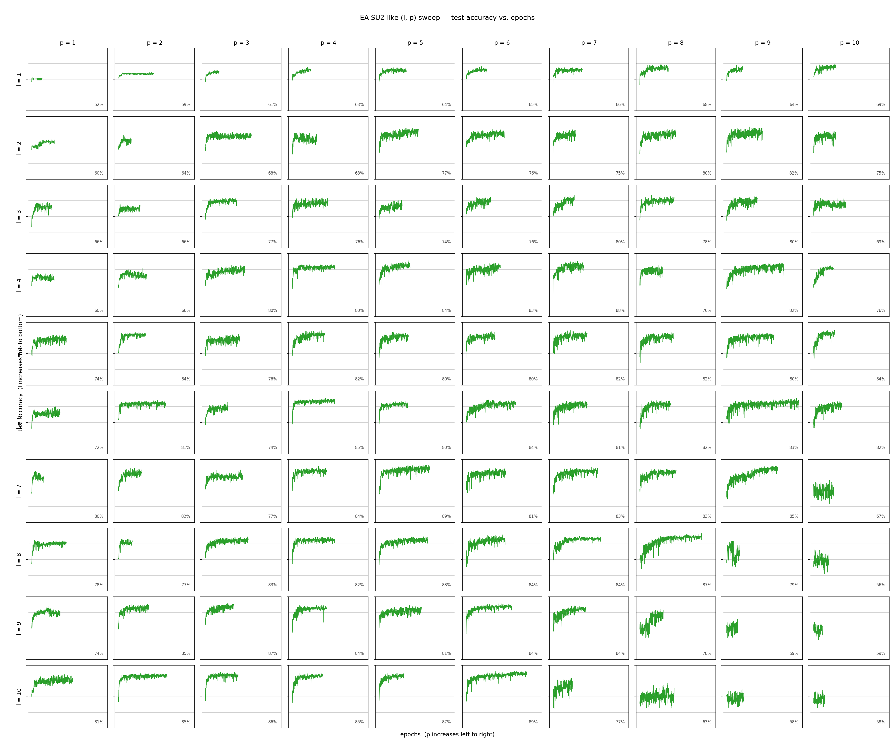

# L/P Architecture Sweep — evolved SU2-like ansatz

**Date:** 2026-07-01
**Cluster job:** SLURM array `16769501` (Yale Bouchet, `day` partition) — 100 tasks, all `COMPLETED`
**Data:** `paper-replication/histories_ea/history_l{1..10}_p{1..10}.json` (100 cells)

**Question:** How does the **evolved SU2-like** tic-tac-toe classifier's converged
test accuracy scale with the two architectural knobs — **L** (number of layers)
and **P** (block repetitions per layer) — and does the board-symmetry weight
sharing that the EA discovered change the scaling law relative to the hand-designed
cemoid ansatz?

**Headline result:** Across the full **10 × 10 grid (L, P ∈ {1…10}, 100 configs;
11 → 1,100 params)**, converged test accuracy rises from **0.520** (L=1, P=1;
11 params) to a plateau in the **0.85–0.89 band**, peaking at **0.893 (L=10, P=6;
660 params)**. The ceiling matches the cemoid class (~0.89–0.90) but the **scaling
is far weaker and non-monotone**: Spearman ρ(params, acc) is only **0.408
(p ≈ 3 × 10⁻⁵)**, versus 0.734 for the cemoid 10×10 grid and 0.896 for the 7×7.
Because each block ties its 27 rotations down to just 11 shared angles, capacity
grows slowly with L·P, and beyond ~600 params the largest configs **collapse** back
toward chance (L=10, P=10 = 0.578; L=8, P=10 = 0.565) — a trainability breakdown the
untied cemoid grid never showed. The evolved winner's own geometry, **L=3, P=2
(66 params)**, scores **0.663** on this single-seed sweep — mid-pack, and below the
500-seed mean of 0.730 for its own architecture (see companion robustness report).

---

## 1. Methodology

### 1.1 Data source

The dataset is generated programmatically from the rules of tic-tac-toe
(`initial_program.py`), not loaded from disk:

- **Board enumeration.** `enumerate_valid_boards()` depth-first expands all legal
  play sequences (cross moves first), recording every unique board state reached;
  recursion stops as soon as a player wins or the board fills. This yields **5,478
  unique legal board states**.
- **Labels (3 classes)** via `board_label()`: `cross` (626), `circle` (316), or
  `draw` (4,536).
- **Board encoding.** Length-9 vector with +1 (cross), −1 (circle), 0 (empty);
  value *i* feeds qubit *i* via an RX rotation scaled by `FEATURE_SCALE = 2π/3`.
- **Label vectors.** ±1 one-hot triples: cross `[+1,−1,−1]`, circle `[−1,+1,−1]`,
  draw `[−1,−1,+1]`.

### 1.2 Train / validation / test splits

`build_data_splits(seed=2027)` draws three **class-balanced** splits (each class
contributes size/3 boards) via `numpy` `default_rng(2027)`:

| Split | Size | Per class | Purpose |
|---|---:|---:|---|
| Train | 450 | 150 | gradient updates |
| Validation | 300 | 100 | early-stopping signal + model selection |
| Test | 600 | 200 | held-out reporting only |

**Data seed fixed at 2027 for all 100 configs** — every architecture trains and is
evaluated on the *same* data; only L, P (and the resulting parameter shape) differ.
Because `circle` has only 316 unique boards, sampling is with replacement to keep
the balanced split sizes. This is byte-for-byte the same pipeline used in the
cemoid sweep (`sweep.py`), so the two sweeps are directly comparable.

### 1.3 Model — the swept architecture (evolved SU2-like block)

The swept per-block circuit is the **converged ShinkaEvolve winner** — patch
`symmetry_grouped_rotations_and_crx_hub`, best program `b6ba28a0…` (generation 16;
see `EA_CONVERGED_RERUN_REPORT.md`). On the 9-qubit tic-tac-toe grid:

- Each **layer** = one RX feature-map (data re-upload) followed by **P** evolved blocks.
- Each block applies full **RX, RY, RZ** single-qubit layers (27 rotation gates)
  whose angles collapse to **9 free parameters** by board-symmetry weight sharing —
  tying the four corners (wires 0/2/4/6), the four edges (1/3/5/7), and the center
  (8) — plus a parametrized **CRZ nearest-neighbour ring** over the 8 outer qubits
  (one shared angle `crz_outer`) and a **CRX hub** coupling each edge to the center
  (one shared angle `crx_inner`). That is **11 unique parameters per block**
  (39 gate instances).
- **Total trainable parameters = 11 · L · P.** The swept grid therefore spans
  **11 → 1,100 parameters**:

  | | P=1 | P=2 | P=3 | P=4 | P=5 | P=6 | P=7 | P=8 | P=9 | P=10 |
  |---|---:|---:|---:|---:|---:|---:|---:|---:|---:|---:|
  | **L=1** | 11 | 22 | 33 | 44 | 55 | 66 | 77 | 88 | 99 | 110 |
  | **L=3** | 33 | **66** | 99 | 132 | 165 | 198 | 231 | 264 | 297 | 330 |
  | **L=10** | 110 | 220 | 330 | 440 | 550 | 660 | 770 | 880 | 990 | 1100 |

  (Only three rows shown; the L=3, P=2 cell = 66 params is the evolved winner's own geometry.)
- Readout: 9 PauliZ expectations mapped to [cross, circle, draw]; argmax = prediction.
- Simulated with PennyLane `default.qubit`, exact (`shots=None`), `diff_method="backprop"`.

Contrast with cemoid: the cemoid block carries **9 free params for 9 gate
instances** (no weight sharing beyond its own corner/edge/center grouping and 3
CRY couplings), so cemoid capacity is 9·L·P and grows faster per block than the
SU2-like 11·L·P despite the higher per-block count — the SU2-like block spends its
gates on a deeper, symmetry-tied rotation stack rather than on independent angles.

### 1.4 Training protocol & stopping criteria (identical for all 100 configs)

- **Optimiser:** Adam, learning rate 0.03.
- **Epoch:** 30 minibatch gradient steps, batch size 15 (train reshuffled each epoch).
- **Loss:** mean squared error between the 3-vector prediction and the ±1 target.
- **Validation-loss early stopping with restore-best-weights:** after every epoch,
  evaluate validation L2 loss; an epoch improves only if it beats the best by
  ≥ `min_delta = 1e-4`; stop after `patience = 75` epochs without improvement;
  hard cap `max_epochs = 1000`. Final model = parameters at the lowest-validation-loss epoch.
- **Reported metric:** `final_test_accuracy` = test accuracy at the restored
  best-validation epoch. The test set drives no training or stopping decision.

### 1.5 Compute

Run as a **100-task SLURM array** (one (L, P) config per task, heaviest-first) on
the Yale Bouchet HPC cluster (`day` partition, 4 CPUs / task), conda env `qml-ea`
(PennyLane 0.45). **SLURM array `16769501`** — all 100 tasks `COMPLETED` (exit 0).
Per-task wall time ranged **3.7 h → 19.1 h**; the deep high-L·P cells were the long
pole. Output dirs are `_ea`-suffixed so they never collide with the cemoid results.

---

## 2. Results

### 2.1 Accuracy grid (converged test accuracy)

| L＼P | 1 | 2 | 3 | 4 | 5 | 6 | 7 | 8 | 9 | 10 |
|---|---:|---:|---:|---:|---:|---:|---:|---:|---:|---:|
| **1** | 0.520 | 0.590 | 0.607 | 0.632 | 0.642 | 0.652 | 0.663 | 0.685 | 0.642 | 0.693 |
| **2** | 0.603 | 0.643 | 0.680 | 0.685 | 0.768 | 0.765 | 0.748 | 0.797 | 0.815 | 0.753 |
| **3** | 0.662 | **0.663** | 0.772 | 0.755 | 0.740 | 0.760 | 0.795 | 0.775 | 0.795 | 0.693 |
| **4** | 0.605 | 0.660 | 0.800 | 0.800 | 0.835 | 0.827 | 0.883 | 0.763 | 0.820 | 0.757 |
| **5** | 0.735 | 0.838 | 0.762 | 0.823 | 0.805 | 0.805 | 0.822 | 0.823 | 0.802 | 0.835 |
| **6** | 0.723 | 0.810 | 0.742 | 0.848 | 0.803 | 0.843 | 0.812 | 0.817 | 0.830 | 0.815 |
| **7** | 0.798 | 0.825 | 0.772 | 0.842 | 0.888 | 0.808 | 0.830 | 0.833 | 0.848 | 0.670 |
| **8** | 0.775 | 0.772 | 0.830 | 0.823 | 0.830 | 0.840 | 0.842 | 0.872 | 0.790 | 0.565 |
| **9** | 0.740 | 0.850 | 0.867 | 0.843 | 0.808 | 0.845 | 0.835 | 0.785 | 0.590 | 0.593 |
| **10** | 0.813 | 0.848 | 0.855 | 0.853 | 0.870 | **0.893** | 0.767 | 0.630 | 0.585 | 0.578 |

(The evolved winner's geometry **L=3, P=2 = 0.663** is shown in bold; the global best
**L=10, P=6 = 0.893** in bold. Parameter count per cell = 11 · L · P.)

### 2.2 Summary statistics (n = 100)

| Metric | Value |
|---|---|
| Mean test accuracy | 0.763 |
| Std (sample) | 0.088 |
| Median | 0.796 |
| IQR (Q1–Q3) | 0.693 – 0.830 |
| Min / Max | 0.520 / 0.893 |
| Best config | **L=10, P=6 → 0.893** (660 params, best epoch 511) |
| Worst config | L=1, P=1 → 0.520 (11 params, best epoch 27) |
| Converged via early stopping | **100 / 100 (100%)** |
| **Spearman ρ (params vs accuracy)** | **0.408 (p ≈ 2.6 × 10⁻⁵)** |
| Pearson r (log-params vs accuracy) | 0.446 (p ≈ 3.3 × 10⁻⁶) |

### 2.3 Accuracy vs. parameter budget

| Param budget | # cells | mean acc | max acc | min acc |
|---|---:|---:|---:|---:|
| ≥ 50 | 92 | 0.777 | 0.893 | 0.565 |
| ≥ 100 | 77 | 0.792 | 0.893 | 0.565 |
| ≥ 200 | 58 | 0.795 | 0.893 | 0.565 |
| ≥ 300 | 45 | 0.790 | 0.893 | 0.565 |
| ≥ 400 | 32 | 0.777 | 0.893 | 0.565 |
| ≥ 600 | 17 | 0.735 | 0.893 | 0.565 |

Unlike the cemoid sweep (where every budget band's mean rises or holds), the
SU2-like means **peak around 200 params (0.795) then fall** — the ≥ 600 band
averages only 0.735 because the deepest cells destabilise (§2.5).

### 2.4 Top 10 and bottom 5 configurations

| Rank | Config | Params | Test acc |
|---|---|---:|---:|
| 1 | L10P6 | 660 | 0.893 |
| 2 | L7P5 | 385 | 0.888 |
| 3 | L4P7 | 308 | 0.883 |
| 4 | L8P8 | 704 | 0.872 |
| 5 | L10P5 | 550 | 0.870 |
| 6 | L9P3 | 297 | 0.867 |
| 7 | L10P3 | 330 | 0.855 |
| 8 | L10P4 | 440 | 0.853 |
| 9 | L9P2 | 198 | 0.850 |
| 10 | L10P2 | 220 | 0.848 |

| Bottom | Config | Params | Test acc |
|---|---|---:|---:|
| 1 | L1P1 | 11 | 0.520 |
| 2 | L8P10 | 880 | 0.565 |
| 3 | L10P10 | 1100 | 0.578 |
| 4 | L10P9 | 990 | 0.585 |
| 5 | L9P9 | 891 | 0.590 |

Four of the five worst configs are among the **largest** (≥ 880 params) — the
opposite of the cemoid sweep, where the worst cells were always the smallest.

### 2.5 Convergence behaviour (n = 100)

| Metric | Value |
|---|---|
| Best-validation epoch — mean / median | 229.0 / 222.5 |
| Best-validation epoch — min / max | 11 / 621 |
| Stopped epoch — mean / median | 304.0 / 297.5 |
| Stopped epoch — min / max | 86 / 696 |

All 100 configs halted on early stopping (none hit the 1000-epoch cap), so the
collapse of the largest cells is **not** undertraining — those configs *converge*
to a low-accuracy validation optimum. Combined with their best-epochs sitting well
inside the run, this is the signature of a **trainability/barren-plateau
breakdown** at high depth for the deeply-tied symmetric ansatz, not a truncated
optimisation.

### 2.6 Region comparison (7×7 vs. frontier)

| Region | # cells | mean acc | max acc |
|---|---:|---:|---:|
| Original 7×7 (L, P ≤ 7) | 49 | 0.749 | 0.888 |
| Frontier (L > 7 or P > 7) | 51 | 0.778 | 0.893 |

The frontier adds only **+0.005** absolute over the 7×7 best (0.893 vs 0.888)
despite reaching 1,100 params — and its mean is dragged by the collapsing deepest
corner. As with cemoid, there is no path to perfect classification here.

### 2.7 Figure

- **Left:** converged test-accuracy heatmap over the 10×10 (L, P) grid. The bright
  band runs through the mid-to-upper grid; note the **dark bottom-right corner**
  (large L *and* large P) where accuracy collapses — a feature absent from the
  cemoid heatmap.
- **Right:** converged test accuracy vs. number of trainable parameters (11·L·P).
  Accuracy climbs to a ~0.85–0.89 plateau by ~200 params, then **fans out
  downward** past ~600 params as the deepest configs destabilise (grey dashed line
  = 0.333 chance level).

---

## 3. Interpretation

1. **Same ceiling, much weaker scaling.** The SU2-like class tops out at ~0.89 —
   the same accuracy ceiling as the cemoid class — but its Spearman ρ(params, acc)
   is only 0.408, half the cemoid 10×10 value (0.734) and less than half the 7×7
   value (0.896). Board-symmetry weight sharing buys **parameter efficiency at
   fixed geometry** (the evolved L3P2 reaches high accuracy for its size), but it
   does *not* give a clean "bigger is better" scaling law: tiling more symmetric
   blocks adds little effective capacity because every block re-imposes the same
   9-fold tie.

2. **Overparameterisation actively hurts.** Past ~600 params the deepest cells
   collapse toward chance (L10P10 = 0.578, L8P10 = 0.565), all fully converged.
   Stacking many deeply-entangled, heavily-tied blocks appears to induce a
   barren-plateau-like trainability breakdown — the model finds a low validation
   optimum and early-stops there. The cemoid ansatz, with independent per-block
   angles and lighter entanglement, never exhibited this.

3. **The evolved winner is a small-model sweet spot, not the peak.** L3P2 (66
   params) scores 0.663 on this single-seed sweep; its own 500-seed mean is 0.730.
   The EA optimised for parameter-efficient accuracy at a *fixed* small geometry —
   and indeed L3P2 is strong for 66 params — but the sweep shows that simply
   scaling that block up does not monotonically climb the way the cemoid sweep did.

4. **Single seeds add noise.** Each cell is one initialisation; the companion
   500-seed study at L3P2 shows a per-config spread of ≈ ±0.04, so mid-grid
   differences smaller than that should not be over-interpreted. The robust findings
   are the weak overall trend, the ~0.89 ceiling, and the large-model collapse.

---

## 4. Reproducibility

| Item | Path / value |
|---|---|
| Per-config converged results | `histories_ea/history_l{L}_p{P}.json` (100 files) |
| Training/evaluation code | `sweep_ea.py` (`train_model`, evolved block) reusing `sweep.py` scaffolding |
| Figure | `lp_sweep_ea_accuracy.png` (`sweep_ea.py --plot-only`) |
| Evolved ANSATZ_SPEC | `EA_CONVERGED_RERUN_REPORT.md` Appendix D (program `b6ba28a0…`, gen 16) |
| Dataset construction | `initial_program.py` (`enumerate_valid_boards`, `build_data_splits`) |
| Cluster job | SLURM array `16769501` (Bouchet, `qml-ea` env, `day` partition, 4 CPUs/task) |
| Early stopping | monitor = validation L2 loss, patience = 75, min_delta = 1e-4, max_epochs = 1000, restore_best_weights = True |
| Data seed (fixed) | 2027 · splits train/val/test = 450 / 300 / 600 (class-balanced, with replacement) |
| Optimiser | Adam, lr 0.03, 30 steps/epoch, batch 15 |
| Params per cell | 11 · L · P (evolved SU2-like block = 11 shared params) |
