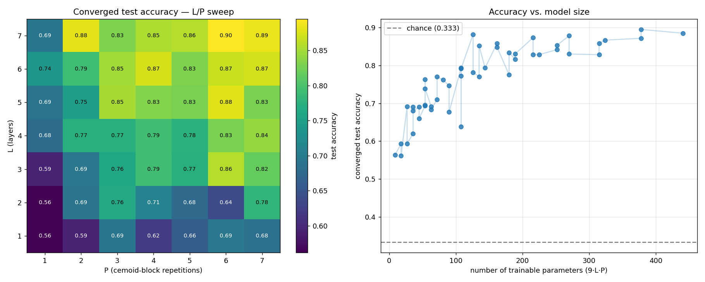
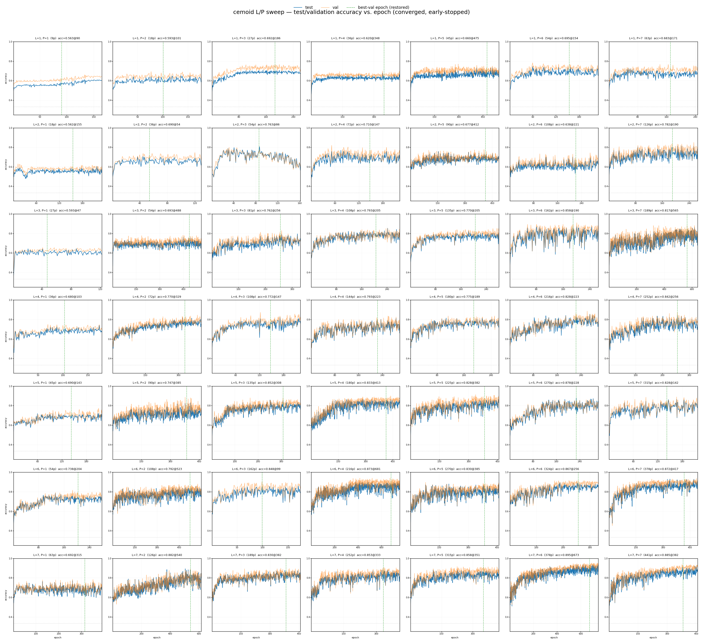

# L/P Architecture Sweep Report — cemoid ansatz (Experiment 0)

**Question:** How does the cemoid tic-tac-toe classifier's test accuracy scale
with the two architectural knobs — **L** (number of layers) and **P** (cemoid-block
repetitions per layer) — when every configuration is trained **to convergence**
rather than for a fixed epoch budget?

**Headline result:** Sweeping the full **7 × 7 grid (L, P ∈ {1…7}, 49 configs)**,
converged test accuracy rises monotonically-on-average with model size, from
**0.562** (L=2, P=1; 18 params) to **0.895** (L=7, P=6; 378 params). Accuracy and
parameter count are strongly rank-correlated (**Spearman ρ = 0.896, p ≈ 4 × 10⁻¹⁸**).
All 49 configurations converged via validation-loss early stopping. The default
config used everywhere else in this project, **L=3, P=2 (54 params), reaches 0.693**
— solidly mid-pack, confirming it as a deliberately economical operating point
rather than the accuracy ceiling.

---

## 1. Methodology

### 1.1 Data source

The dataset is generated programmatically from the rules of tic-tac-toe
(`initial_program.py`), not loaded from disk:

- **Board enumeration.** `enumerate_valid_boards()` depth-first expands all legal
  play sequences (cross moves first), recording every unique board state reached;
  recursion stops as soon as a player wins or the board fills (post-win positions
  excluded, intermediate non-terminal positions kept). This yields **5,478 unique
  legal board states**.
- **Labels (3 classes)** via `board_label()`: `cross` (cross 3-in-a-row), `circle`
  (circle 3-in-a-row), or `draw` (everything else). Natural distribution is highly
  imbalanced — cross 626, circle 316, draw 4,536.
- **Board encoding.** Length-9 vector with +1 (cross), −1 (circle), 0 (empty);
  value *i* feeds qubit *i* via an RX rotation scaled by `FEATURE_SCALE = 2π/3`.
- **Label vectors.** ±1 one-hot triples: cross `[+1,−1,−1]`, circle `[−1,+1,−1]`,
  draw `[−1,−1,+1]`.

### 1.2 Train / validation / test splits

`build_data_splits(seed=2027)` draws three **class-balanced** splits (each class
contributes size/3 boards), sampled with `numpy` `default_rng(2027)`:

| Split | Size | Per class | Purpose |
|---|---:|---:|---|
| Train | 450 | 150 | gradient updates |
| Validation | 300 | 100 | early-stopping signal + model selection |
| Test | 600 | 200 | held-out reporting only |

**Data seed is fixed at 2027 for all 49 configs** — every architecture trains and
is evaluated on the *same* data; only L, P (and the resulting parameter shape)
differ. Because `circle` has only 316 unique boards, sampling is done **with
replacement** to keep the balanced split sizes (an inherent limitation of the
small board space, not a choice of this experiment).

### 1.3 Model — the swept architecture

The cemoid ansatz on 9 qubits arranged on the tic-tac-toe grid:

- Each **layer** = one RX feature-map (data re-upload) followed by **P** cemoid blocks.
- Each cemoid block carries **9 shared trainable parameters** (corner/edge/center
  RX+RZ angles and three CRY coupling angles).
- **Total trainable parameters = 9 · L · P.** The swept grid therefore spans
  **9 → 441 parameters**:

  | | P=1 | P=2 | P=3 | P=4 | P=5 | P=6 | P=7 |
  |---|---:|---:|---:|---:|---:|---:|---:|
  | **L=1** | 9 | 18 | 27 | 36 | 45 | 54 | 63 |
  | **L=2** | 18 | 36 | 54 | 72 | 90 | 108 | 126 |
  | **L=3** | 27 | 54 | 81 | 108 | 135 | 162 | 189 |
  | **L=4** | 36 | 72 | 108 | 144 | 180 | 216 | 252 |
  | **L=5** | 45 | 90 | 135 | 180 | 225 | 270 | 315 |
  | **L=6** | 54 | 108 | 162 | 216 | 270 | 324 | 378 |
  | **L=7** | 63 | 126 | 189 | 252 | 315 | 378 | 441 |

- Readout: 9 PauliZ expectations mapped to [cross, circle, draw]; argmax = prediction.
- Simulated with PennyLane `default.qubit`, exact (`shots=None`), `diff_method="backprop"`.

### 1.4 Training protocol & stopping criteria (identical for all 49 configs)

- **Optimiser:** Adam, learning rate 0.03.
- **Epoch:** 30 minibatch gradient steps, batch size 15 (train set reshuffled each epoch).
- **Loss:** mean squared error between the 3-vector prediction and the ±1 target.
- **Validation-loss early stopping with restore-best-weights:** after every epoch,
  evaluate validation L2 loss; an epoch improves only if it beats the best by
  ≥ `min_delta = 1e-4`; stop after `patience = 75` epochs without improvement;
  hard cap `max_epochs = 1000`; soft walltime cap ≈ 23.3 h. The final model is the
  parameters from the lowest-validation-loss epoch.
- **Reported metric:** `final_test_accuracy` = test accuracy at the restored
  best-validation epoch. The test set drives no training or stopping decision.

### 1.5 Compute

Run as a **49-task SLURM array** (one (L, P) config per task), heaviest-first, on
the Yale Bouchet HPC cluster (`day` partition, 8 CPUs / 12 GB per task), conda env
`qml-ea` (PennyLane 0.45). **SLURM job `16408759`.** Deep L5–L7 configs were the
long pole (largest, L7P7 = 441 params).

---

## 2. Results

### 2.1 Accuracy grid (converged test accuracy)

| L＼P | 1 | 2 | 3 | 4 | 5 | 6 | 7 |
|---|---:|---:|---:|---:|---:|---:|---:|
| **1** | 0.563 | 0.593 | 0.692 | 0.620 | 0.660 | 0.695 | 0.683 |
| **2** | 0.562 | 0.690 | 0.763 | 0.710 | 0.677 | 0.638 | 0.782 |
| **3** | 0.593 | **0.693** | 0.762 | 0.793 | 0.770 | 0.858 | 0.817 |
| **4** | 0.680 | 0.770 | 0.772 | 0.793 | 0.775 | 0.828 | 0.842 |
| **5** | 0.690 | 0.747 | 0.852 | 0.833 | 0.828 | 0.878 | 0.828 |
| **6** | 0.738 | 0.792 | 0.848 | 0.873 | 0.830 | 0.867 | 0.872 |
| **7** | 0.692 | 0.882 | 0.830 | 0.853 | 0.858 | **0.895** | 0.885 |

(The project default **L=3, P=2 = 0.693** is shown in bold; the global best **L=7, P=6 = 0.895** in bold.)

### 2.2 Summary statistics (n = 49)

| Metric | Value |
|---|---|
| Mean test accuracy | 0.764 |
| Std (sample) | 0.093 |
| Median | 0.775 |
| IQR (Q1–Q3) | 0.692 – 0.842 |
| Min / Max | 0.562 / 0.895 |
| Best config | **L=7, P=6 → 0.895** (378 params, best epoch 673) |
| Worst config | L=2, P=1 → 0.562 (18 params, best epoch 155) |
| Converged via early stopping | **49 / 49 (100%)** |
| **Spearman ρ (params vs accuracy)** | **0.896 (p ≈ 3.8 × 10⁻¹⁸)** |

### 2.3 Convergence behaviour (n = 49)

| Metric | Value |
|---|---|
| Best-validation epoch — mean / median | 280.8 / 228 |
| Best-validation epoch — min / max | 47 / 681 |

Convergence epochs scatter widely (47–681) and the median (228) sits **well beyond
the old fixed cutoff of 100** — the larger architectures in particular keep
improving for hundreds of epochs, reinforcing that a fixed 100-epoch budget would
have under-trained most of this grid (especially the high-accuracy corner).

### 2.4 Figure

- **Left:** converged test-accuracy heatmap over the full 7×7 (L, P) grid. The
  accuracy gradient runs from the bottom-left (small models, dark) to the top-right
  (large models, yellow).
- **Right:** converged test accuracy vs. number of trainable parameters (9·L·P).
  Accuracy climbs steeply up to ≈ 100 parameters then enters a **diminishing-returns
  plateau** in the 0.83–0.90 band; the grey dashed line is the 0.333 chance level.

### 2.5 Per-config training curves (test/validation accuracy vs. epoch)

The figure below is a **7 × 7 grid of the full training trajectories** — one
subplot per (L, P) configuration, arranged **L = 1→7 top-to-bottom (rows)** and
**P = 1→7 left-to-right (columns)**. Within each panel:

- **blue** = test accuracy per epoch, **orange** = validation accuracy per epoch;
- the **green dashed line** marks the restored best-validation epoch (the model
  actually reported in §2.1 — chosen by validation, never by peeking at test);
- the faint dotted line is the 0.333 chance level;
- each panel's title reads `L=x, P=y (Np) acc=…@best_epoch`.

**Every subplot carries its own epoch axis** because early stopping halts each
configuration at a different point — the x-axis tick numbers therefore differ panel
to panel (e.g. L=1,P=1 stops by ~170 epochs, while L=6,P=4 runs to ~680). Tick
labels are intentionally small so the 49 independent axes never overlap.

What the trajectories reveal that the heatmap cannot:

- **Small models (top-left) saturate early and noisily** near ~0.55–0.65 — they
  reach their (low) ceiling within tens of epochs and then only fluctuate. Their
  best-val markers sit far to the left.
- **Large models (bottom-right) keep climbing for hundreds of epochs** toward
  ~0.85–0.90, with the test and validation curves tracking each other closely (no
  large generalisation gap). Their best-val markers sit far to the **right** —
  several past epoch 500 (e.g. L=7,P=6 @673, L=6,P=4 @681, L=7,P=2 @540).
- **Direct evidence the old fixed-100-epoch protocol under-trained the grid.** In
  the bottom and right panels the curve at epoch 100 is still well below its
  eventual plateau, and the green best-val line lands hundreds of epochs later — so
  a hard 100-epoch cutoff would have truncated exactly the high-capacity configs
  mid-climb, flattening the measured scaling trend.
- **Validation sits at or slightly above test throughout** for most configs (the
  orange line rarely runs below blue), consistent with the balanced
  validation/test splits and with selecting the reported model by validation loss.

---

## 3. Interpretation

1. **Capacity scales accuracy — strongly and monotonically on average.** The
   Spearman ρ = 0.896 (p ≈ 4 × 10⁻¹⁸) between parameter count and converged
   accuracy is about as clean a scaling signal as a 49-point grid can give. Both
   knobs help, and they are roughly interchangeable through their product L·P
   (configs of equal 9·L·P land close together — e.g. L3P2, L2P3, L6P1 all ≈ 54
   params and cluster near 0.69–0.76).

2. **Returns diminish past ~100 parameters.** Accuracy jumps from ~0.56 to ~0.80
   over the first 100 parameters, then flattens into a 0.83–0.90 plateau. Beyond
   ~150 params the grid buys only a few more points of accuracy at multiplying
   training cost — the L7P7 (441-param) corner does *not* beat L7P6 (378 params).

3. **The L=3, P=2 default is an economy choice, not the ceiling.** At 54 parameters
   it reaches 0.693 — mid-pack and ~0.20 below the best corner — but it trains
   roughly an order of magnitude faster than the L6–L7 configs. It is the right
   point for the seed-robustness and optimizer-benchmark experiments (where many
   repeats matter more than peak accuracy), while the sweep documents how much
   headroom a larger model would unlock.

4. **Single seeds add noise to the grid.** Each cell is one initialisation, so some
   roughness is expected (e.g. the L2P6 = 0.638 dip). The companion 500-seed study
   at L3P2 shows the per-config seed spread is ≈ ±0.04, so differences smaller than
   that within the grid should not be over-interpreted; the *trend* is the robust
   finding.

---

## 4. Reproducibility

| Item | Path / value |
|---|---|
| Per-config converged results | `histories/history_l{L}_p{P}.json` (49 files) |
| Analysis + figure script | `analyze_results.py` (`analyze_sweep`) |
| Figures | `lp_sweep_converged.png` (heatmap/scaling) · `lp_sweep_accuracy_curves.png` (7×7 per-config curves, `plot_lp_curves.py`) |
| Training/evaluation code | `sweep.py` (`train_model`) |
| Dataset construction | `initial_program.py` (`enumerate_valid_boards`, `build_data_splits`) |
| Cluster job | SLURM array `16408759` (Bouchet, `qml-ea` env, `day` partition) |
| Early stopping | monitor = validation L2 loss, patience = 75, min_delta = 1e-4, max_epochs = 1000, restore_best_weights = True |
| Data seed (fixed) | 2027 · splits train/val/test = 450 / 300 / 600 (class-balanced, with replacement) |
| Optimiser | Adam, lr 0.03, 30 steps/epoch, batch 15 |
